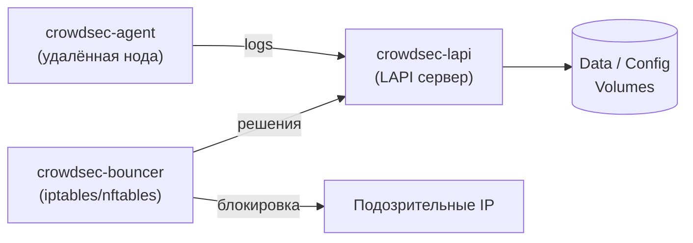

# CrowdSec

Развёртывание [CrowdSec](https://www.crowdsec.net/) в Docker Compose: LAPI-сервер и агенты с баунсером для блокировки.

## Структура

```
crowdsec/
├── README.md
├── crowdsec_lapi/
│   └── compose.yml          # Docker Compose для LAPI-сервера
└── crowdsec_node/
    ├── compose.yml           # Docker Compose для агента + баунсера
    ├── .env.example          # Шаблон переменных окружения
    └── config/
        ├── acquis.yaml                          # Настройка источников логов
        └── crowdsec-firewall-bouncer.yaml       # Настройки iptables/nftables баунсера
```

## Схема работы



## LAPI-сервер

Перед установкой LAPI убедись, что у тебя настроен reverse proxy (Nginx / Caddy / Traefik). LAPI слушает на `127.0.0.1:8082` — все запросы от агентов и баунсеров должны приходит на твой домен и проксироваться на этот порт.

Скачай конфиги и запусти:

```bash
curl -L https://github.com/thegrayfoxxx/configs/archive/main.tar.gz | tar xz --strip=2 '*/crowdsec/crowdsec_lapi'
cd crowdsec_lapi
docker compose up -d
```

### Что нужно изменить в `compose.yml`

| Параметр | Где искать | Что делать |
|---|---|---|
| `TZ` | `environment` | Указать свой часовой пояс, например `Europe/Moscow` |
| `ports` | `ports` | Порт на хосте (`8082`). Можно изменить, если занят |

> Конфиги CrowdSec (`acquis.yaml`, профили и т.д.) хранятся в Docker volume `crowdsec-config`. Чтобы править их с хоста, можно заменить volume на bind mount или заходить в контейнер через `docker exec -it crowdsec-lapi sh`.

После настройки прокси укажи этот домен в `LOCAL_API_URL` на нодах.

### Что делает LAPI

- Принимает логи от агентов и принимает решения о блокировке.
- Выдаёт токены баунсерам.
- Хранит данные и конфигурацию в Docker Volumes (`crowdsec-data`, `crowdsec-config`).
- По умолчанию установлена коллекция `crowdsecurity/linux`, которая включает базовые парсеры для syslog и SSH.

### Команды управления LAPI

**Просмотр статуса:**

```bash
docker exec crowdsec-lapi cscli lapi status
```

**Просмотр установленных коллекций и парсеров:**

```bash
docker exec crowdsec-lapi cscli hub list
```

**Просмотр активных решений (блокировок):**

```bash
docker exec crowdsec-lapi cscli decisions list
```

**Просмотр зарегистрированных машин (агентов):**

```bash
docker exec crowdsec-lapi cscli machines list
```

**Просмотр зарегистрированных баунсеров:**

```bash
docker exec crowdsec-lapi cscli bouncers list
```

**Добавление коллекции (например, для Traefik или nginx):**

```bash
docker exec crowdsec-lapi cscli collections install crowdsecurity/traefik
docker exec crowdsec-lapi cscli collections install crowdsecurity/nginx
```

## CrowdSec Node (агент + баунсер)

Удалённая нода состоит из двух контейнеров, которые запускаются одним стеком:

- **crowdsec-agent** — собирает логи с хоста и отправляет их на LAPI.
- **crowdsec-bouncer** — получает от LAPI решения и блокирует IP через iptables/nftables в режиме host network.

Скачай конфиги:

```bash
curl -L https://github.com/thegrayfoxxx/configs/archive/main.tar.gz | tar xz --strip=2 '*/crowdsec/crowdsec_node'
cd crowdsec_node
```

### Что нужно изменить в `compose.yml`

| Параметр | Где | Что сделать |
|---|---|---|
| `LOCAL_API_URL` | `environment` агента | Указать URL твоего LAPI (домен из reverse proxy) |
| `API_URL` | `environment` баунсера | Тот же URL LAPI |
| `TZ` | `environment` агента | Указать свой часовой пояс |
| `AGENT_USERNAME` / `AGENT_PASSWORD` | `.env` | Заполнить после регистрации агента в LAPI |
| `API_KEY` | `.env` | Заполнить после регистрации баунсера в LAPI |
| Пути к логам | `volumes` агента | Подставить актуальные пути для твоей системы |

> Пути к логам могут отличаться в зависимости от дистрибутива. На некоторых системах `auth.log` отсутствует — вместо него может быть `/var/log/secure`. Проверь и подправь при необходимости.

### Подготовка на стороне LAPI

Перед запуском агента и баунсера их нужно зарегистрировать в LAPI.

**Регистрация агента:**

```bash
docker exec crowdsec-lapi cscli machines add \
  --name имя-агента \
  --password пароль-агента \
  --force
```

Сгенерировать пароль можно командой:

```bash
openssl rand -base64 32
```

> Пароль передаётся агенту через переменные окружения `AGENT_USERNAME` и `AGENT_PASSWORD` в `.env`.

**Регистрация баунсера:**

```bash
docker exec crowdsec-lapi cscli bouncers add имя-баунсера
```

Команда вернёт API-токен. Скопируй его в переменную `API_KEY` в `.env`.

### Развёртывание

1. Скопируй `.env.example` и отредактируй:

```bash
cp .env.example .env
# Заполни AGENT_USERNAME, AGENT_PASSWORD и API_KEY
```

2. Запусти стек:

```bash
docker compose up -d
```

### Переменные окружения

#### `crowdsec-agent`

| Переменная | Описание |
|---|---|
| `DISABLE_LOCAL_API` | Всегда `true` — агент не содержит встроенного LAPI |
| `LOCAL_API_URL` | URL LAPI-сервера (например, `https://crowdsec.example.com`) |
| `COLLECTIONS` | Коллекции для загрузки на агенте (например, `crowdsecurity/linux crowdsecurity/sshd`) |
| `TZ` | Часовой пояс |
| `AGENT_USERNAME` | Имя агента, зарегистрированное в LAPI |
| `AGENT_PASSWORD` | Пароль агента |

#### `crowdsec-bouncer`

| Переменная | Описание |
|---|---|
| `MODE` | Режим блокировки: `iptables` или `nftables` |
| `API_URL` | URL LAPI-сервера (тот же, что у агента) |
| `API_KEY` | Токен, полученный при регистрации баунсера |

### Настройка acquis.yaml

Файл `config/acquis.yaml` определяет, какие логи читает агент:

```yaml
filenames:
  - /var/log/auth.log
  - /var/log/syslog
labels:
  type: syslog
```

Если нужно добавить другие источники логов (например, `/var/log/nginx/access.log`), допиши их в `filenames` и пробрось соответствующий volume в `compose.yml`.

### Просмотр статуса ноды

**На самой ноде:**

```bash
docker exec crowdsec-agent cscli lapi status
```

**На LAPI (видна ли машина):**

```bash
docker exec crowdsec-lapi cscli machines list
```

## Полезные команды

| Команда | Описание |
|---|---|
| `docker exec crowdsec-lapi cscli metrics` | Метрики и статистика |
| `docker exec crowdsec-lapi cscli alerts list` | Список срабатываний |
| `docker exec crowdsec-lapi cscli alerts inspect <id>` | Детали срабатывания |
| `docker exec crowdsec-lapi cscli decisions delete --ip <IP>` | Разблокировать IP вручную |
| `docker compose logs -f` | Логи контейнеров (из папки сервиса) |

## Обновление

```bash
# LAPI
cd crowdsec/crowdsec_lapi
docker compose pull
docker compose up -d

# Node
cd crowdsec/crowdsec_node
docker compose pull
docker compose up -d
```
