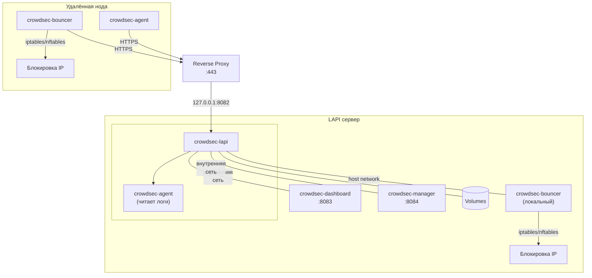

# CrowdSec

Набор скриптов и конфигураций для развёртывания [CrowdSec](https://www.crowdsec.net/) в Docker Compose: LAPI-сервер и агенты с баунсером для блокировки.

## Оглавление

- [Используемые образы](#используемые-образы)
- [Схема работы](#схема-работы)
- [Тестовое окружение](#тестовое-окружение)
- [Порядок настройки](#порядок-настройки)
- [Структура](#структура)
- [1. LAPI-сервер](#1-lapi-сервер)
  - [Reverse proxy](#reverse-proxy)
  - [Управление LAPI через скрипт](#управление-lapi-через-скрипт)
  - [Команды управления LAPI](#команды-управления-lapi)
- [2. CrowdSec Node](#2-crowdsec-node-агент--баунсер)
  - [Быстрый способ — через скрипт](#быстрый-способ--через-скрипт)
  - [Пошаговая настройка (вручную)](#пошаговая-настройка-вручную)
  - [Управление нодой через скрипт](#управление-нодой-через-скрипт)
  - [Просмотр статуса](#просмотр-статуса)
  - [Проверка баунсера](#проверка-баунсера)
  - [Настройка источников логов](#настройка-источников-логов-acquisyaml)
- [Traffic Guard (блоклисты)](#traffic-guard-блоклисты)
- [Общая библиотека common.sh](#общая-библиотека-scriptslibcommonsh)
- [Обновление конфигов](#обновление-конфигов)
- [Переменные окружения](#переменные-окружения)
- [Зависимости](#зависимости)

Архитектура разделена на две независимые части:
- **LAPI** (`crowdsec_lapi/`) — центральный сервер с API, дашбордом, менеджером и локальным баунсером
- **Node** (`crowdsec_node/`) — удалённые ноды, агенты которых подключаются к LAPI

## Используемые образы

| Компонент | Образ | Источник |
|---|---|---|
| LAPI / Agent | [`crowdsecurity/crowdsec`](https://hub.docker.com/r/crowdsecurity/crowdsec) | Docker Hub |
| Dashboard | [`theduffman85/crowdsec-web-ui`](https://github.com/theduffman85/crowdsec-web-ui) | GitHub Packages |
| Bouncer | [`shgew/cs-firewall-bouncer-docker`](https://github.com/shgew/cs-firewall-bouncer-docker) | GitHub Packages |
| Manager | [`hhftechnology/crowdsec-manager`](https://github.com/hhftechnology/crowdsec-manager) | Docker Hub |

## Схема работы



## Тестовое окружение

Конфигурации протестированы на **Debian 12** и **Debian 13**.

## Порядок настройки

1. **LAPI** — поднять центральный сервер с LAPI, Dashboard (опционально), Manager (опционально) и локальным баунсером.
2. **Node** — на каждой удалённой ноде зарегистрировать агента и баунсера на LAPI, развернуть стек.

---

## Структура

```
crowdsec/
├── crowdsec_lapi/                          # LAPI-сервер
│   ├── compose-example.yml                 # Docker Compose: LAPI + Dashboard + Manager + bouncer
│   ├── lapi.sh                             # 🧰 главное меню LAPI
│   ├── config/
│   │   ├── acquis.yaml                     # настройка источников логов
│   │   └── crowdsec-firewall-bouncer.yaml  # настройки баунсера
│   └── scripts/
│       ├── lib/common.sh                   # общая библиотека (цвета, хелперы)
│       ├── setup-node.sh                   # регистрация удалённой ноды
│       ├── traffic-guard.sh                # 🛡️ управление блоклистами
│       ├── traffic-guard.cfg               # конфиг длительности бана
│       ├── update.sh                       # обновление конфигов из репозитория
│       └── blocklists/                     # скачанные блоклисты
│
└── crowdsec_node/                          # удалённая нода
    ├── compose-example.yml                 # Docker Compose: agent + bouncer
    ├── node.sh                             # 🖥️ главное меню ноды
    ├── config/
    │   ├── acquis.yaml                     # настройка источников логов
    │   └── crowdsec-firewall-bouncer.yaml  # настройки iptables/nftables
    └── scripts/
        ├── lib/common.sh                   # общая библиотека (цвета, хелперы)
        └── update.sh                       # обновление конфигов из репозитория
```

---

## 1. LAPI-сервер

На LAPI-сервере запускается LAPI, Dashboard, Manager, агент (читает логи самого сервера) и локальный баунсер.

### Reverse proxy

LAPI слушает на `127.0.0.1:8082` и не должен быть доступен напрямую. Настрой reverse proxy (Nginx / Caddy / Traefik), который будет принимать HTTPS-запросы от удалённых нод и проксировать их на `127.0.0.1:8082`.

Полученный домен (`https://crowdsec.example.com`) понадобится в `API_URL`.

### Шаг 1 — скачай конфиги

```bash
curl -L https://github.com/thegrayfoxxx/configs/archive/main.tar.gz | tar xz --wildcards --strip=2 '*/crowdsec/crowdsec_lapi'
cd crowdsec_lapi
```

### Шаг 2 — подготовь файлы

```bash
cp compose-example.yml compose.yml
cp .env.example .env
```

Отредактируй `.env` — укажи часовой пояс и пароли:

```dotenv
TZ=Europe/Moscow
API_KEY_FOR_LOCAL_BOUNCER=сюда-вставить-ключ-после-шага-4
CROWDSEC_PASSWORD=пароль-для-панели
```

**Что поправить в `compose.yml`:**

| Параметр | Что сделать |
|---|---|
| Пути к логам | Подставить актуальные пути для твоей системы |

> Пути к логам могут отличаться в зависимости от дистрибутива. На некоторых системах вместо `auth.log` может быть `/var/log/secure`.

### Шаг 3 — запусти LAPI

```bash
docker compose up -d
```

### Шаг 4 — зарегистрируй локальный баунсер

```bash
docker exec crowdsec-lapi cscli bouncers add local-bouncer
```

Команда вернёт ключ. Скопируй его в `.env`:

```dotenv
API_KEY_FOR_LOCAL_BOUNCER=полученный-ключ
```

Перезапусти стек:

```bash
docker compose up -d
```

### Шаг 5 — подключи Dashboard

```bash
docker exec crowdsec-lapi cscli machines add dashboard \
  --password пароль-для-панели \
  --force
```

Обнови `.env`, если не сделал это раньше:

```dotenv
CROWDSEC_USER=dashboard
CROWDSEC_PASSWORD=пароль-для-панели
```

Перезапусти стек:

```bash
docker compose up -d
```

> **Важно:** у Dashboard нет собственной авторизации. Обязательно ограничь доступ на reverse proxy.

### CrowdSec Manager

[Manager](https://github.com/hhftechnology/crowdsec-manager) — альтернативный веб-интерфейс для управления CrowdSec. Доступен на `127.0.0.1:8084`.

Порты сервисов:

| Сервис | Порт | Описание |
|---|---|---|
| LAPI | `127.0.0.1:8082` | API для подключения нод и прокси |
| Dashboard | `127.0.0.1:8083` | Веб-интерфейс (theduffman85) |
| Manager | `127.0.0.1:8084` | Альтернативный веб-интерфейс (hhftechnology) |

> Manager и Dashboard — опциональные сервисы. Если они не нужны, закомментируй или удали соответствующие блоки в `compose.yml` и volume.

### Управление LAPI через скрипт

Для повседневных задач используй `lapi.sh`:

```bash
./lapi.sh
```

Меню:

| Пункт | Действие |
|---|---|
| `1` | Обновить конфиги из репозитория |
| `2` | Зарегистрировать удалённую ноду |
| `3` | Traffic Guard — управление блоклистами |
| `0` | Выход |

### Команды управления LAPI

**Статус:**

```bash
docker exec crowdsec-lapi cscli lapi status
```

**Коллекции и парсеры:**

```bash
docker exec crowdsec-lapi cscli hub list
```

**Установка коллекции (после перезапусти контейнер):**

```bash
docker exec crowdsec-lapi cscli collections install crowdsecurity/traefik
docker exec crowdsec-lapi cscli collections install crowdsecurity/nginx
docker restart crowdsec-lapi
```

**Решения (блокировки):**

```bash
docker exec crowdsec-lapi cscli decisions list
docker exec crowdsec-lapi cscli decisions delete --ip <IP>
```

**Алерты:**

```bash
docker exec crowdsec-lapi cscli alerts list
docker exec crowdsec-lapi cscli alerts inspect <id>
```

**Метрики и статистика:**

```bash
docker exec crowdsec-lapi cscli metrics
```

**Логи контейнеров:**

```bash
docker compose logs -f
```

**Машины и баунсеры:**

```bash
docker exec crowdsec-lapi cscli machines list
docker exec crowdsec-lapi cscli bouncers list
```

**Удаление агента (машины):**

```bash
docker exec crowdsec-lapi cscli machines delete имя-агента
```

**Удаление баунсера:**

```bash
docker exec crowdsec-lapi cscli bouncers delete имя-баунсера
```

---

## 2. CrowdSec Node (агент + баунсер)

Удалённая нода запускается на каждом хосте, который нужно защищать. Состоит из двух контейнеров:

- **crowdsec-agent** — собирает логи с хоста и отправляет на LAPI
- **crowdsec-bouncer** — получает от LAPI решения и блокирует IP через iptables/nftables

> Перед началом убедись, что LAPI уже запущен и доступен через reverse proxy.

### Быстрый способ — через скрипт

На LAPI запусти регистрацию:

```bash
cd crowdsec_lapi
./lapi.sh                      # → пункт 2
# или напрямую:
bash scripts/setup-node.sh     # можно указать имя: bash scripts/setup-node.sh us6
```

Скрипт создаст `имя-agent` и `имя-bouncer`, сгенерирует пароль, получит API-токен и выведет готовую команду для ноды. Скопируй её и выполни на удалённой ноде.

### Пошаговая настройка (вручную)

#### Шаг 1 — скачай конфиги

```bash
curl -L https://github.com/thegrayfoxxx/configs/archive/main.tar.gz | tar xz --wildcards --strip=2 '*/crowdsec/crowdsec_node'
cd crowdsec_node
```

#### Шаг 2 — подготовь файлы

```bash
cp compose-example.yml compose.yml
cp .env.example .env
```

Отредактируй `.env`:

```dotenv
API_URL=https://crowdsec.example.com
TZ=Europe/Moscow
AGENT_USERNAME=имя-агента
AGENT_PASSWORD=сгенерированный-пароль
API_KEY=токен-баунсера
```

**Что поправить в `compose.yml`:**

| Параметр | Что сделать |
|---|---|
| Пути к логам | Подставить актуальные пути для твоей системы |

#### Шаг 3 — зарегистрируй ноду на LAPI

```bash
# Сгенерируй пароль
openssl rand -base64 32
```

```bash
# Зарегистрируй агента (выполняется на LAPI)
docker exec crowdsec-lapi cscli machines add имя-агента \
  --password сгенерированный-пароль \
  --force
```

```bash
# Зарегистрируй баунсера (выполняется на LAPI)
docker exec crowdsec-lapi cscli bouncers add имя-баунсера
```

#### Шаг 4 — запусти ноду

```bash
docker compose up -d
```

### Управление нодой через скрипт

```bash
./node.sh
```

Меню:

| Пункт | Действие |
|---|---|
| `1` | Обновить конфиги из репозитория |
| `2` | Статус (контейнеры + количество блокировок) |
| `3` | Перезапустить контейнеры |
| `0` | Выход |

### Просмотр статуса

**На ноде — проверить связь с LAPI:**

```bash
docker exec crowdsec-agent cscli lapi status
```

**На LAPI — проверить, что машина видна:**

```bash
docker exec crowdsec-lapi cscli machines list
```

**На LAPI — проверить, что баунсер зарегистрирован:**

```bash
docker exec crowdsec-lapi cscli bouncers list
```

### Проверка баунсера

Баунсер работает в режиме host network и блокирует IP через iptables/nftables.

```bash
# Логи баунсера
docker compose logs crowdsec-bouncer

# Проверить правила блокировки
sudo ipset list crowdsec-blacklists-0 -t
```

В строке `Number of entries` — количество заблокированных IP.

**Принудительно проверить блокировку (создать тестовое решение):**

```bash
docker exec crowdsec-lapi cscli decisions add --ip 1.2.3.4 --duration 1m
# Подожди 10-15 секунд и проверь:
sudo ipset list crowdsec-blacklists-0 2>/dev/null | grep 1.2.3.4 || sudo nft list table ip crowdsec 2>/dev/null | grep 1.2.3.4
# Удали:
docker exec crowdsec-lapi cscli decisions delete --ip 1.2.3.4
```

### Настройка источников логов (acquis.yaml)

Файл `config/acquis.yaml` определяет, какие логи читать. По умолчанию:

```yaml
filenames:
  - /var/log/auth.log
  - /var/log/syslog
labels:
  type: syslog
```

Чтобы добавить другие источники (например, `/var/log/nginx/access.log`), допиши их в `filenames` и пробрось соответствующий volume в `compose.yml`. После изменения перезапусти агента:

```bash
docker compose restart crowdsec-agent
```

---

## Traffic Guard (блоклисты)

Управление блоклистами Traffic Guard — скачивает публичные списки IP (сканеры, правительственные сети) и импортирует их в LAPI как решения с указанным сроком.

Источники списков: [shadow-netlab/traffic-guard-lists](https://github.com/shadow-netlab/traffic-guard-lists)

| Список | Описание | Срок бана по умолчанию |
|---|---|---|
| `traffic-guard-scanners` | IP-адреса сканеров и ботов | 30 дней |
| `traffic-guard-gov-networks` | Правительственные сети | 90 дней |
| `traffic-guard-skipa` | Список skipa | 90 дней |

```bash
./scripts/traffic-guard.sh      # интерактивное меню
# или из меню LAPI: пункт 3
```

**Режимы командной строки (для cron):**

| Команда | Действие |
|---|---|
| `./traffic-guard.sh download` | Только скачать списки |
| `./traffic-guard.sh apply` | Применить списки в LAPI |
| `./traffic-guard.sh install` | Скачать + применить |
| `./traffic-guard.sh remove` | Удалить все решения |
| `./traffic-guard.sh status` | Показать статус |

**Пункты меню:**

| Пункт | Действие |
|---|---|
| `1` | Скачать блоклисты локально |
| `2` | Установить блоклисты в LAPI |
| `3` | Полное обновление: скачать + установить |
| `4` | Удалить списки из LAPI |
| `5` | Настроить срок бана для каждого списка |
| `6` | Настроить cron для автообновления |

Конфиг длительности бана хранится в `traffic-guard.cfg`, создаётся автоматически при первом сохранении.

> Благодарность проекту [shadow-netlab/traffic-guard-lists](https://github.com/shadow-netlab/traffic-guard-lists) за публичные списки IP, которые используются Traffic Guard для блокировки сканеров и вредоносного трафика.

---

## Общая библиотека `scripts/lib/common.sh`

Каждая часть (lapi и node) содержит свою копию `common.sh`. Доступные функции:

| Функция | Назначение |
|---|---|
| `clear_screen()` | Очистка экрана с fallback, если `tput` недоступен |
| `log_info()` / `log_warn()` / `log_error()` | Цветной вывод сообщений |
| `die()` | Вывод ошибки и выход |
| `print_header(title, icon)` | Шапка меню в рамке |
| `require_cmd(cmd, hint)` | Проверка наличия утилиты |
| `lapi_is_running()` | Проверка, запущен ли контейнер `crowdsec-lapi` (только в LAPI) |
| `require_lapi()` | То же, но с `die()` при ошибке (только в LAPI) |

## Обновление конфигов

Скрипты скачивают свежие файлы из репозитория. После обновления скопируй шаблон и перезапусти контейнеры.

Через главные скрипты:

```bash
# LAPI
cd crowdsec_lapi
./lapi.sh → пункт 1

# Node
cd crowdsec_node
./node.sh → пункт 1
```

Напрямую:

```bash
# LAPI
cd crowdsec_lapi/scripts
./update.sh && cd .. && cp compose-example.yml compose.yml && docker compose up -d

# Node
cd crowdsec_node/scripts
./update.sh && cd .. && docker compose up -d
```

## Переменные окружения

### LAPI

| Переменная | Описание |
|---|---|
| `API_LOCAL_PORT` | Порт для LAPI на хосте (по умолчанию `8082`) |
| `TZ` | Часовой пояс, например `Europe/Moscow` |
| `API_KEY_FOR_LOCAL_BOUNCER` | API-ключ для локального баунсера |
| `CROWDSEC_USER` | Логин для дашборда |
| `CROWDSEC_PASSWORD` | Пароль для дашборда |

### Node

| Переменная | Описание |
|---|---|
| `API_URL` | URL LAPI-сервера |
| `TZ` | Часовой пояс |
| `AGENT_USERNAME` | Имя агента, зарегистрированное в LAPI |
| `AGENT_PASSWORD` | Пароль агента |
| `API_KEY` | API-ключ баунсера |

## Зависимости

- **bash** 4+ (для `declare -A` в `traffic-guard.sh`)
- **docker** с Docker Compose
- **curl** (для скачивания списков и обновлений)
- **tar** (для распаковки обновлений)
- **openssl** (для генерации паролей в `setup-node.sh`)
- **ipset** + **sudo** (на ноде для просмотра блокировок)
