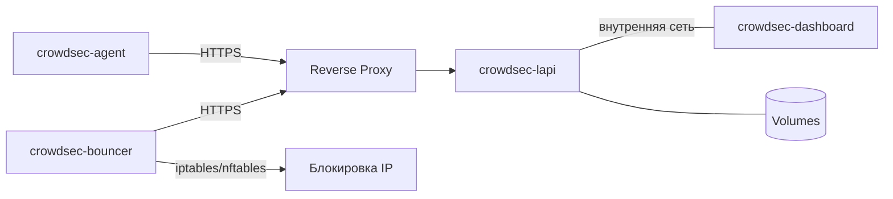

# CrowdSec

Развёртывание [CrowdSec](https://www.crowdsec.net/) в Docker Compose: LAPI-сервер и агенты с баунсером для блокировки.

## Используемые образы

| Компонент | Образ | Источник |
|---|---|---|
| LAPI / Agent | [`crowdsecurity/crowdsec`](https://hub.docker.com/r/crowdsecurity/crowdsec) | Docker Hub |
| Dashboard | [`theduffman85/crowdsec-web-ui`](https://github.com/theduffman85/crowdsec-web-ui) | GitHub Packages |
| Bouncer | [`shgew/cs-firewall-bouncer-docker`](https://github.com/shgew/cs-firewall-bouncer-docker) | GitHub Packages |

## Схема работы



## Структура

```
crowdsec/
├── README.md
├── crowdsec_lapi/
│   ├── compose.yml          # Docker Compose для LAPI-сервера и Dashboard
│   └── .env.example         # Шаблон переменных для Dashboard
└── crowdsec_node/
    ├── compose.yml           # Docker Compose для агента + баунсера
    ├── .env.example          # Шаблон переменных окружения
    └── config/
        ├── acquis.yaml                          # Настройка источников логов
        └── crowdsec-firewall-bouncer.yaml       # Настройки iptables/nftables баунсера
```

## Тестовое окружение

Конфигурации протестированы на **Debian 12** и **Debian 13**.

## Порядок настройки

1. **LAPI** — поднять центральный сервер с reverse proxy и Dashboard.
2. **Dashboard** — зарегистрировать машину, создать `.env`.
3. **Node** — на каждой удалённой ноде зарегистрировать агента и баунсера на LAPI, развернуть стек.

---

## 1. LAPI-сервер

### Reverse proxy

LAPI слушает на `127.0.0.1:8082` и не должен быть доступен напрямую. Настрой reverse proxy (Nginx / Caddy / Traefik), который будет принимать HTTPS-запросы от агентов и баунсеров и проксировать их на `127.0.0.1:8082`.

Полученный домен (`https://crowdsec.example.com`) понадобится позже в `LOCAL_API_URL` и `API_URL` на нодах.

### Запуск

```bash
curl -L https://github.com/thegrayfoxxx/configs/archive/main.tar.gz | tar xz --wildcards --strip=2 '*/crowdsec/crowdsec_lapi'
cd crowdsec_lapi
docker compose up -d
```

### Что нужно изменить

| Параметр | Где искать | Что делать |
|---|---|---|
| `TZ` | `environment` (LAPI) | Указать свой часовой пояс, например `Europe/Moscow` |
| `ports` | `ports` (LAPI) | Порт на хосте (`8082`). Можно изменить, если занят |

> Конфиги CrowdSec хранятся в Docker volume `crowdsec-config`. Чтобы править их с хоста, замени volume на bind mount или заходи в контейнер: `docker exec -it crowdsec-lapi sh`.

### CrowdSec Dashboard

Вместе с LAPI запускается веб-интерфейс для просмотра алертов, решений и статистики. Доступен по адресу `http://IP-сервера:8083`.

> **Важно:** у Dashboard нет собственной авторизации. Обязательно ограничь доступ на reverse proxy (IP-белый список, базовая аутентификация или VPN).

Создай `.env` из шаблона:

```bash
cp .env.example .env
```

Dashboard подключается к LAPI как машина (machine). Зарегистрируй её:

```bash
docker exec crowdsec-lapi cscli machines add dashboard \
  --password пароль-для-панели \
  --force
```

Имя и пароль укажи в `.env`:

```dotenv
CROWDSEC_USER=имя-машины
CROWDSEC_PASSWORD=пароль-машины
```

После этого пересоздай контейнер dashboard, чтобы он применил credentials:

```bash
docker compose up -d
```

### Команды управления LAPI

**Статус:**

```bash
docker exec crowdsec-lapi cscli lapi status
```

**Коллекции и парсеры:**

```bash
docker exec crowdsec-lapi cscli hub list
```

**Установка коллекции (после перезапусти контейнер):**

```bash
docker exec crowdsec-lapi cscli collections install crowdsecurity/traefik
docker exec crowdsec-lapi cscli collections install crowdsecurity/nginx
docker restart crowdsec-lapi
```

**Решения (блокировки):**

```bash
docker exec crowdsec-lapi cscli decisions list
```

**Машины и баунсеры:**

```bash
docker exec crowdsec-lapi cscli machines list
docker exec crowdsec-lapi cscli bouncers list
```

---

## 2. CrowdSec Node (агент + баунсер)

Удалённая нода запускается на каждом хосте, который нужно защищать. Состоит из двух контейнеров:

- **crowdsec-agent** — собирает логи с хоста и отправляет на LAPI.
- **crowdsec-bouncer** — получает от LAPI решения и блокирует IP через iptables/nftables.

> Перед началом убедись, что LAPI уже запущен и доступен через reverse proxy.

### Скачай конфиги

```bash
curl -L https://github.com/thegrayfoxxx/configs/archive/main.tar.gz | tar xz --wildcards --strip=2 '*/crowdsec/crowdsec_node'
cd crowdsec_node
```

### Что нужно изменить

| Параметр | Где | Что сделать |
|---|---|---|
| `LOCAL_API_URL` | `environment` агента | Указать URL твоего LAPI (домен из reverse proxy) |
| `API_URL` | `environment` баунсера | Тот же URL LAPI |
| `TZ` | `environment` агента | Указать свой часовой пояс |
| Пути к логам | `volumes` агента | Подставить актуальные пути для твоей системы |

> Пути к логам могут отличаться в зависимости от дистрибутива. На некоторых системах вместо `auth.log` может быть `/var/log/secure`. Проверь и подправь.

### Подготовка на LAPI

Зарегистрируй агента и баунсера на уже запущенном LAPI.

**Агент (регистрируется как машина):**

```bash
docker exec crowdsec-lapi cscli machines add имя-агента \
  --password пароль-агента \
  --force
```

Сгенерировать пароль:

```bash
openssl rand -base64 32
```

> Имя и пароль передаются агенту через `.env` (`AGENT_USERNAME`, `AGENT_PASSWORD`).

**Баунсер:**

```bash
docker exec crowdsec-lapi cscli bouncers add имя-баунсера
```

Команда вернёт API-токен. Скопируй его — он понадобится в `.env` (`API_KEY`).

### Развёртывание

1. Создай `.env` из шаблона и заполни:

```bash
cp .env.example .env
```

```dotenv
AGENT_USERNAME=имя-агента
AGENT_PASSWORD=пароль-агента
API_KEY=токен-баунсера
```

2. Запусти стек:

```bash
docker compose up -d
```

### Переменные окружения

#### `crowdsec-agent`

| Переменная | Описание |
|---|---|
| `DISABLE_LOCAL_API` | Всегда `true` — агент без встроенного LAPI |
| `LOCAL_API_URL` | URL LAPI-сервера (например, `https://crowdsec.example.com`) |
| `COLLECTIONS` | Коллекции (например, `crowdsecurity/linux crowdsecurity/sshd`) |
| `TZ` | Часовой пояс |
| `AGENT_USERNAME` | Имя агента, зарегистрированное в LAPI |
| `AGENT_PASSWORD` | Пароль агента |

#### `crowdsec-bouncer`

| Переменная | Описание |
|---|---|
| `MODE` | Режим блокировки: `iptables` или `nftables` |
| `API_URL` | URL LAPI-сервера (тот же, что у агента) |
| `API_KEY` | Токен, полученный при регистрации баунсера |

### Настройка acquis.yaml

Файл `config/acquis.yaml` определяет источники логов:

```yaml
filenames:
  - /var/log/auth.log
  - /var/log/syslog
labels:
  type: syslog
```

Чтобы добавить другие источники (например, `/var/log/nginx/access.log`), допиши их в `filenames` и пробрось соответствующий volume в `compose.yml`.

После изменения `acquis.yaml` перезапусти агента:

```bash
docker compose restart crowdsec-agent
```

### Просмотр статуса

**На ноде — проверить связь с LAPI:**

```bash
docker exec crowdsec-agent cscli lapi status
```

**На LAPI — проверить, что машина видна:**

```bash
docker exec crowdsec-lapi cscli machines list
```

---

## Полезные команды

| Команда | Описание |
|---|---|
| `docker exec crowdsec-lapi cscli metrics` | Метрики и статистика |
| `docker exec crowdsec-lapi cscli alerts list` | Список срабатываний |
| `docker exec crowdsec-lapi cscli alerts inspect <id>` | Детали срабатывания |
| `docker exec crowdsec-lapi cscli decisions delete --ip <IP>` | Разблокировать IP |
| `docker compose logs -f` | Логи контейнеров (из папки сервиса) |

## Обновление

```bash
# LAPI
cd $HOME/crowdsec_lapi
docker compose pull
docker compose up -d

# Node
cd $HOME/crowdsec_node
docker compose pull
docker compose up -d
```
