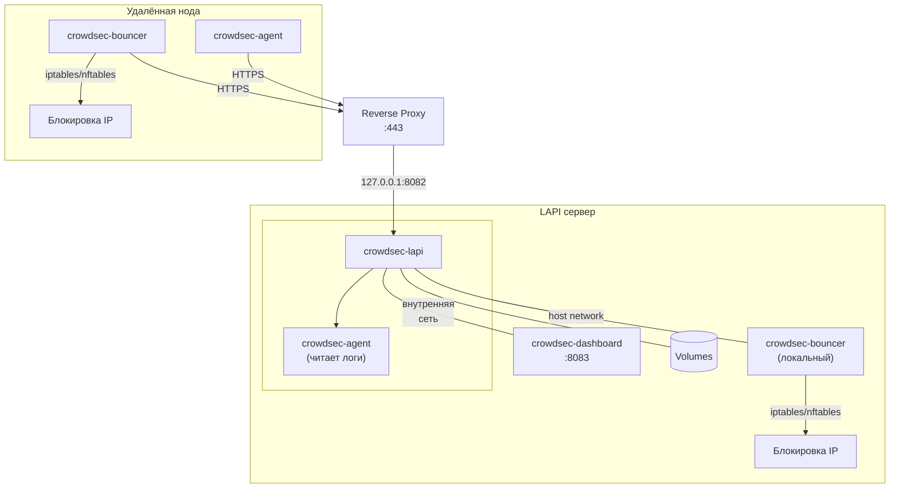

# CrowdSec

Развёртывание [CrowdSec](https://www.crowdsec.net/) в Docker Compose: LAPI-сервер и агенты с баунсером для блокировки.

## Используемые образы

| Компонент | Образ | Источник |
|---|---|---|
| LAPI / Agent | [`crowdsecurity/crowdsec`](https://hub.docker.com/r/crowdsecurity/crowdsec) | Docker Hub |
| Dashboard | [`theduffman85/crowdsec-web-ui`](https://github.com/theduffman85/crowdsec-web-ui) | GitHub Packages |
| Bouncer | [`shgew/cs-firewall-bouncer-docker`](https://github.com/shgew/cs-firewall-bouncer-docker) | GitHub Packages |

## Схема работы



## Структура

```
crowdsec/
├── README.md
├── crowdsec_lapi/
│   ├── lapi.sh                    # 🧰 Главный скрипт (меню)
│   ├── compose-example.yml        # Docker Compose: LAPI + Dashboard + bouncer
│   ├── .env.example               # Шаблон переменных
│   ├── config/
│   │   ├── acquis.yaml            # Настройка источников логов
│   │   └── crowdsec-firewall-bouncer.yaml  # Настройки локального баунсера
│   └── scripts/
│       ├── update.sh              # Обновление конфигов
│       ├── setup-node.sh          # Регистрация удалённой ноды
│       └── traffic-guard.sh       # 🛡️ Управление блоклистами
│
└── crowdsec_node/
    ├── node.sh                    # 🖥️ Главный скрипт (меню)
    ├── compose-example.yml        # Docker Compose: agent + bouncer
    ├── .env.example               # Шаблон переменных
    ├── config/
    │   ├── acquis.yaml            # Настройка источников логов
    │   └── crowdsec-firewall-bouncer.yaml  # Настройки iptables/nftables
    └── scripts/
        └── update.sh              # Обновление конфигов
```

## Тестовое окружение

Конфигурации протестированы на **Debian 12** и **Debian 13**.

## Порядок настройки

1. **LAPI** — поднять центральный сервер с LAPI, Dashboard и локальным баунсером.
2. **Node** — на каждой удалённой ноде зарегистрировать агента и баунсера на LAPI, развернуть стек.

---

## 1. LAPI-сервер

На LAPI-сервере запускается LAPI, Dashboard, агент (читает логи самого сервера) и локальный баунсер.

### Reverse proxy

LAPI слушает на `127.0.0.1:8082` и не должен быть доступен напрямую. Настрой reverse proxy (Nginx / Caddy / Traefik), который будет принимать HTTPS-запросы от удалённых нод и проксировать их на `127.0.0.1:8082`.

Полученный домен (`https://crowdsec.example.com`) понадобится в `API_URL`.

### Шаг 1 — скачай конфиги

```bash
curl -L https://github.com/thegrayfoxxx/configs/archive/main.tar.gz | tar xz --wildcards --strip=2 '*/crowdsec/crowdsec_lapi'
cd crowdsec_lapi
```

### Шаг 2 — подготовь файлы

```bash
cp compose-example.yml compose.yml
cp .env.example .env
```

**Что поправить в `compose.yml`:**

| Параметр | Что сделать |
|---|---|
| Пути к логам | Подставить актуальные пути для твоей системы |

> Пути к логам могут отличаться в зависимости от дистрибутива. На некоторых системах вместо `auth.log` может быть `/var/log/secure`.

**Что поправить в `.env`:**

| Переменная | Что указать |
|---|---|
| `TZ` | Часовой пояс, например `Europe/Moscow` |
| `API_LOCAL_PORT` | Порт для LAPI на хосте (по умолчанию `8082`) |
| `API_URL` | Внешний домен LAPI (для удалённых нод) |

### Шаг 3 — запусти LAPI

```bash
docker compose up -d
```

### Шаг 4 — зарегистрируй локальный баунсер

```bash
docker exec crowdsec-lapi cscli bouncers add local-bouncer
```

Команда вернёт ключ. Скопируй его в `.env`:

```dotenv
API_KEY_FOR_LOCAL_BOUNCER=полученный-ключ
```

Перезапусти стек:

```bash
docker compose up -d
```

### Шаг 5 — подключи Dashboard

```bash
docker exec crowdsec-lapi cscli machines add dashboard \
  --password пароль-для-панели \
  --force
```

Обнови `.env`:

```dotenv
CROWDSEC_USER=dashboard
CROWDSEC_PASSWORD=пароль-для-панели
```

Перезапусти стек:

```bash
docker compose up -d
```

> **Важно:** у Dashboard нет собственной авторизации. Обязательно ограничь доступ на reverse proxy.

### Управление LAPI

Для повседневных задач используй `lapi.sh`:

```bash
cd crowdsec_lapi
./lapi.sh
```

Меню:
- **1** — обновить конфиги из репозитория
- **2** — зарегистрировать удалённую ноду
- **3** — Traffic Guard (управление блоклистами)

### Команды управления LAPI

**Статус:**

```bash
docker exec crowdsec-lapi cscli lapi status
```

**Коллекции и парсеры:**

```bash
docker exec crowdsec-lapi cscli hub list
```

**Установка коллекции (после перезапусти контейнер):**

```bash
docker exec crowdsec-lapi cscli collections install crowdsecurity/traefik
docker exec crowdsec-lapi cscli collections install crowdsecurity/nginx
docker restart crowdsec-lapi
```

**Решения (блокировки):**

```bash
docker exec crowdsec-lapi cscli decisions list
docker exec crowdsec-lapi cscli decisions delete --ip <IP>
```

**Алерты:**

```bash
docker exec crowdsec-lapi cscli alerts list
docker exec crowdsec-lapi cscli alerts inspect <id>
```

**Метрики и статистика:**

```bash
docker exec crowdsec-lapi cscli metrics
```

**Логи контейнеров:**

```bash
docker compose logs -f
```

**Машины и баунсеры:**

```bash
docker exec crowdsec-lapi cscli machines list
docker exec crowdsec-lapi cscli bouncers list
```

**Удаление агента (машины):**

```bash
docker exec crowdsec-lapi cscli machines delete имя-агента
```

**Удаление баунсера:**

```bash
docker exec crowdsec-lapi cscli bouncers delete имя-баунсера
```

---

## 2. CrowdSec Node (агент + баунсер)

Удалённая нода запускается на каждом хосте, который нужно защищать. Состоит из двух контейнеров:

- **crowdsec-agent** — собирает логи с хоста и отправляет на LAPI.
- **crowdsec-bouncer** — получает от LAPI решения и блокирует IP через iptables/nftables.

> Перед началом убедись, что LAPI уже запущен и доступен через reverse proxy.

Есть два способа настройки ноды:

**Вариант 1 — через скрипт (быстро).** Зарегистрируй ноду на LAPI одной командой:

```bash
cd crowdsec_lapi
./lapi.sh
# выбери пункт 2
```

Или напрямую:

```bash
cd crowdsec_lapi/scripts
./setup-node.sh имя-ноды
```

Скрипт создаст `имя-ноды-agent` и `имя-ноды-bouncer`, сгенерирует пароль, получит API-токен и выведет готовую команду для ноды.

**Вариант 2 — вручную (пошагово).** Выполни шаги 1–4 ниже.

### Шаг 1 — скачай конфиги

```bash
curl -L https://github.com/thegrayfoxxx/configs/archive/main.tar.gz | tar xz --wildcards --strip=2 '*/crowdsec/crowdsec_node'
cd crowdsec_node
```

### Шаг 2 — подготовь файлы

```bash
cp compose-example.yml compose.yml
cp .env.example .env
```

**Что поправить в `compose.yml`:**

| Параметр | Что сделать |
|---|---|
| Пути к логам | Подставить актуальные пути для твоей системы |

> Пути к логам могут отличаться в зависимости от дистрибутива. На некоторых системах вместо `auth.log` может быть `/var/log/secure`. Проверь и подправь.

### Шаг 3 — зарегистрируй ноду на LAPI (вручную)

```bash
openssl rand -base64 32
```

```bash
docker exec crowdsec-lapi cscli machines add имя-агента \
  --password сгенерированный-пароль \
  --force
```

```bash
docker exec crowdsec-lapi cscli bouncers add имя-баунсера
```

Команда вернёт API-токен. Скопируй его.

### Шаг 4 — заполни `.env` и запусти

```dotenv
API_URL=https://crowdsec.example.com
TZ=Europe/Moscow
AGENT_USERNAME=имя-агента
AGENT_PASSWORD=сгенерированный-пароль
API_KEY=токен-баунсера
```

```bash
docker compose up -d
```

### Управление нодой

Для повседневных задач используй `node.sh`:

```bash
cd crowdsec_node
./node.sh
```

Меню:
- **1** — обновить конфиги из репозитория
- **2** — статус (контейнеры + количество блокировок)
- **3** — перезапустить контейнеры

### Переменные окружения

#### `crowdsec-agent`

| Переменная | Описание |
|---|---|
| `DISABLE_LOCAL_API` | Всегда `true` — агент без встроенного LAPI |
| `LOCAL_API_URL` | URL LAPI-сервера (берётся из `API_URL` в `.env`) |
| `COLLECTIONS` | Коллекции (например, `crowdsecurity/linux crowdsecurity/sshd`) |
| `TZ` | Часовой пояс (из `.env`) |
| `AGENT_USERNAME` | Имя агента, зарегистрированное в LAPI |
| `AGENT_PASSWORD` | Пароль агента |

#### `crowdsec-bouncer`

| Переменная | Описание |
|---|---|
| `MODE` | Режим блокировки: `iptables` или `nftables` |
| `API_URL` | URL LAPI-сервера (берётся из `API_URL` в `.env`) |
| `API_KEY` | Токен, полученный при регистрации баунсера |

### Настройка acquis.yaml

Файл `config/acquis.yaml` определяет источники логов:

```yaml
filenames:
  - /var/log/auth.log
  - /var/log/syslog
labels:
  type: syslog
```

Чтобы добавить другие источники (например, `/var/log/nginx/access.log`), допиши их в `filenames` и пробрось соответствующий volume в `compose.yml`.

После изменения `compose.yml` или конфигов перезапусти агента:

```bash
docker compose restart crowdsec-agent
```

### Просмотр статуса

**На ноде — проверить связь с LAPI:**

```bash
docker exec crowdsec-agent cscli lapi status
```

**На LAPI — проверить, что машина видна:**

```bash
docker exec crowdsec-lapi cscli machines list
```

**На LAPI — проверить, что баунсер зарегистрирован:**

```bash
docker exec crowdsec-lapi cscli bouncers list
```

### Проверка баунсера

Баунсер работает в режиме host network и блокирует IP через iptables/nftables.

**Логи баунсера:**

```bash
docker compose logs crowdsec-bouncer
```

**Проверить правила блокировки:**

```bash
sudo ipset list crowdsec-blacklists-0 -t
```

В строке `Number of entries` — количество заблокированных IP.

**Принудительно проверить блокировку (создать тестовое решение):**

```bash
docker exec crowdsec-lapi cscli decisions add --ip 1.2.3.4 --duration 1m
# Подожди 10-15 секунд и проверь:
sudo ipset list crowdsec-blacklists-0 2>/dev/null | grep 1.2.3.4 || sudo nft list table ip crowdsec 2>/dev/null | grep 1.2.3.4
# Удали:
docker exec crowdsec-lapi cscli decisions delete --ip 1.2.3.4
```

---

## Обновление

Скрипты скачивают свежие файлы из репозитория. После обновления скопируй шаблон (для LAPI) и перезапусти контейнеры.

Через главные скрипты:

```bash
# LAPI
cd crowdsec_lapi
./lapi.sh
# выбери пункт 1

# Node
cd crowdsec_node
./node.sh
# выбери пункт 1
```

Или напрямую:

```bash
# LAPI
cd crowdsec_lapi/scripts
./update.sh
cd ..
cp compose-example.yml compose.yml
docker compose up -d

# Node
cd crowdsec_node/scripts
./update.sh
cd ..
docker compose up -d
```
