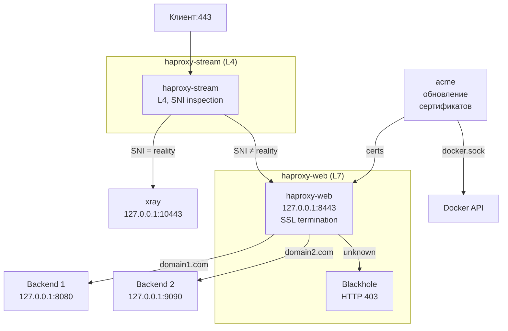

# HAProxy

TLS-прокси для маршрутизации трафика по SNI с автоматическим управлением сертификатами.

## Оглавление

- [Используемые образы](#используемые-образы)
- [Схема работы](#схема-работы)
- [Тестовое окружение](#тестовое-окружение)
- [Порядок настройки](#порядок-настройки)
- [Структура](#структура)
- [Быстрый старт](#быстрый-старт)
- [Главное меню](#главное-меню)
- [Управление сайтами](#управление-сайтами)
- [Управление Reality](#управление-reality)
- [Управление сертификатами](#управление-сертификатами)
- [Конфигурация](#конфигурация)
- [Общая библиотека common.sh](#общая-библиотека-scriptslibcommonsh)
- [Обновление конфигов](#обновление-конфигов)
- [Переменные окружения](#переменные-окружения)
- [Зависимости](#зависимости)

## Используемые образы

| Компонент | Образ | Источник |
|---|---|---|
| HAProxy Stream | [`haproxy:alpine`](https://hub.docker.com/_/haproxy) | Docker Hub |
| HAProxy Web | [`haproxy:alpine`](https://hub.docker.com/_/haproxy) | Docker Hub |
| ACME | [`neilpang/acme.sh`](https://hub.docker.com/r/neilpang/acme.sh) | Docker Hub |

## Схема работы



## Тестовое окружение

Конфигурации протестированы на **Debian 12** и **Debian 13**.

## Порядок настройки

1. **Скачивание** — получить конфиги из репозитория
2. **Подготовка** — настроить порты (root в контейнере или sysctl)
3. **Запуск** — `./haproxy.sh` интерактивно создаст `sites.conf`
4. **Сайты** — добавить веб-сайты через меню
5. **Reality** — добавить домены для xray
6. **Сертификаты** — выпустить и задеплоить

---

## Скачивание

### Через curl

```bash
curl -L https://github.com/thegrayfoxxx/configs/archive/main.tar.gz | tar xz --wildcards --strip=2 '*/haproxy'
cd haproxy
```

### Через git clone

```bash
git clone https://github.com/thegrayfoxxx/configs.git
cd configs/haproxy
```

---

## Структура

```
haproxy/
├── haproxy.sh                    # главное меню
├── compose.yml                   # Docker Compose: stream + web + acme
├── sites.conf                    # конфигурация (генерируется скриптами)
├── sites.conf.example            # шаблон конфигурации
├── stream/
│   ├── haproxy.cfg               # генерируется из sites.conf
│   └── haproxy.cfg.example       # шаблон
├── web/
│   ├── haproxy.cfg               # генерируется из sites.conf
│   ├── haproxy.cfg.example       # шаблон
│   └── certs/                    # PEM-файлы сертификатов
└── scripts/
    ├── lib/common.sh             # общая библиотека (цвета, генерация, хелперы)
    ├── site.sh                   # управление сайтами
    ├── reality.sh                # управление reality
    ├── cert.sh                   # управление сертификатами
    └── update.sh                 # обновление из репозитория
```

---

## Быстрый старт

### Шаг 1 — запусти

```bash
cd haproxy
./haproxy.sh
```

При первом запуске:
1. Если `sites.conf` нет — интерактивный опрос (email, reality, сайты)
2. Если конфигов HAProxy нет — автоматическая генерация
3. Если `sites.conf` новее конфигов — предложение перегенерировать

### Шаг 2 — добавь сайт

```
1 → Ввести домен и порт бэкенда
```

Скрипт автоматически:
1. Обновит `sites.conf`
2. Сгенерирует `stream/haproxy.cfg` и `web/haproxy.cfg`
3. Предложит выпустить сертификат
4. Предложит перезапустить сервисы

### Шаг 3 — добавь reality

```
2 → Ввести домены через пробел и порт xray
```

Скрипт автоматически:
1. Обновит `sites.conf`
2. Сгенерирует конфиги
3. Предложит перезапустить сервисы

---

## Ручная настройка (без скриптов)

### Шаг 1 — создай sites.conf

```bash
cp sites.conf.example sites.conf
```

Отредактируй `sites.conf`:

```bash
ACME_EMAIL="mailname@example.com"

WEB_SITES=(
  "site1.com:11443"
)

REALITY_SITES=(
  "google.com www.google.com:10443"
)
```

### Шаг 2 — сгенерируй конфиги

```bash
source scripts/lib/common.sh
generate_configs
```

Или скопируй шаблоны и отредактируй вручную:

```bash
cp stream/haproxy.cfg.example stream/haproxy.cfg
cp web/haproxy.cfg.example web/haproxy.cfg
```

### Шаг 3 — запусти

```bash
docker compose up -d
```

### Шаг 4 — выпусти сертификат

```bash
docker compose exec acme acme.sh --issue -d "example.com" --standalone --httpport 80 --email "mailname@example.com"
docker compose exec acme acme.sh --deploy -d "example.com" --deploy-hook haproxy
```

### Шаг 5 — перезапусти

```bash
docker restart haproxy-web
```

---

## Главное меню

```bash
./haproxy.sh
```

В шапке отображается статус:

```
┌─────────────────────────────────────────────┐
│  🔧  HAPROXY MANAGER
└─────────────────────────────────────────────┘

┌─────────────────────────────────────────────┐
│  Сервисы: ● stream  ● web  ● acme
│  Конфиг:  2 сайтов  1 reality
│  HAProxy:  ок
│  Серты:   3
└─────────────────────────────────────────────┘
```

| Индикатор | Значение |
|-----------|----------|
| `● stream / web / acme` | Зелёный = запущен, красный = остановлен |
| `Сайтов / reality` | Количество из `sites.conf` |
| `HAProxy: ок` | Конфиги синхронизированы |
| `HAProxy: устарели` | `sites.conf` новее конфигов |
| `HAProxy: нет конфигов` | Конфиги не сгенерированы |
| `Серты: N` | Количество PEM-файлов в `web/certs/` |

**Пункты меню:**

| Пункт | Действие |
|-------|----------|
| `1` | Управление сайтами |
| `2` | Управление Reality |
| `3` | Управление сертификатами |
| `4` | Статус сервисов |
| `5` | Перезапустить все сервисы |
| `6` | Логи |
| `7` | Обновить конфиги из репозитория |
| `8` | Перегенерировать конфиги HAProxy |

---

## Управление сайтами

```bash
./haproxy.sh → пункт 1
```

| Пункт | Действие |
|-------|----------|
| `1` | Добавить сайт |
| `2` | Удалить сайт |
| `3` | Список сайтов |
| `0` | Назад |

### Добавление сайта

Скрипт спросит:
1. **Домен** — например, `example.com`
2. **Порт бэкенда** — куда проксировать (например, `8080`)

После добавления:
- Обновляется `sites.conf`
- Генерируются `stream/haproxy.cfg` и `web/haproxy.cfg`
- Предлагается выпустить сертификат
- Предлагается перезапустить сервисы

### Формат записи в sites.conf

```bash
WEB_SITES=(
  "domain.com:8080"
  "api.example.com:9090"
)
```

---

## Управление Reality

```bash
./haproxy.sh → пункт 2
```

| Пункт | Действие |
|-------|----------|
| `1` | Добавить reality |
| `2` | Удалить reality |
| `3` | Список reality |
| `0` | Назад |

### Добавление reality

Скрипт спросит:
1. **Домены через пробел** — например, `google.com www.google.com`
2. **Порт xray** — по умолчанию `10443`

### Формат записи в sites.conf

```bash
REALITY_SITES=(
  "google.com www.google.com:10443"
)
```

---

## Управление сертификатами

```bash
./haproxy.sh → пункт 3
```

| Пункт | Действие |
|-------|----------|
| `1` | Выпустить сертификат |
| `2` | Деплой сертификата |
| `3` | Выпустить + деплой |
| `4` | Список сертификатов |
| `5` | Проверить сертификат |
| `6` | Удалить сертификат |
| `7` | Принудительно обновить |
| `0` | Назад |

### Выпуск сертификата

```bash
docker compose exec acme acme.sh --issue -d "example.com" --standalone --httpport 80 --email "mailname@example.com"
```

### Деплой в HAProxy

```bash
docker compose exec acme acme.sh --deploy -d "example.com" --deploy-hook haproxy
```

Deploy hook автоматически:
- Объединяет приватный ключ и fullchain в один PEM-файл
- Сохраняет в `/etc/haproxy/certs`
- Перезапускает `haproxy-web` через Docker socket API

### Автоматическое обновление

acme.sh обновляет сертификаты каждые 30 дней. После обновления deploy hook автоматически перезапускает `haproxy-web`.

---

## Конфигурация

### sites.conf

Единственный источник правды. Конфиги HAProxy генерируются из него автоматически.

```bash
ACME_EMAIL="mailname@example.com"

# Сайты (L7, SSL termination через haproxy-web)
WEB_SITES=(
  "site1.com:11443"
  "example.com:8080"
)

# Reality (L4, напрямую на xray)
REALITY_SITES=(
  "google.com www.google.com:10443"
)
```

### Генерация конфигов

Конфиги генерируются автоматически при:
- Добавлении/удалении сайтов
- Добавлении/удалении reality
- Первом запуске (интерактивная настройка)
- Ручной перегенерации (пункт 8 в меню)

Также проверяется синхронизация: если `sites.conf` новее конфигов, скрипт предложит перегенерировать.

### Пример сгенерированного stream/haproxy.cfg

```
global
    log stdout format raw local0
    maxconn 4096

defaults
    log     global
    mode    tcp
    ...

frontend ft_https
    bind *:443
    mode tcp
    tcp-request inspect-delay 5s
    tcp-request content accept if { req.ssl_hello_type 1 }

    acl is_reality req.ssl_sni -i google.com www.google.com
    use_backend bk_xray if is_reality

    default_backend bk_haproxy_web

backend bk_xray
    mode tcp
    server xray 127.0.0.1:10443

backend bk_haproxy_web
    mode tcp
    server haproxy_web 127.0.0.1:8443
```

### Пример сгенерированного web/haproxy.cfg

```
global
    ...
    crt-base /etc/haproxy/certs

frontend ft_https_terminated
    bind *:8443 ssl crt /etc/haproxy/certs/
    mode http

    acl host_site_com_com hdr(host) -i site.com
    use_backend bk_site_com_com if host_site_com_com

    default_backend bk_blackhole

backend bk_site_com_com
    mode http
    server site_com_com 127.0.0.1:8080

backend bk_blackhole
    mode http
    http-request deny
```

### Volumes

| Volume | Описание |
|--------|----------|
| `acme:/acme.sh` | Внутренние данные acme.sh (аккаунт, сертификаты) |
| `./web/certs:/etc/haproxy/certs` | Выпущенные сертификаты (PEM-файлы) |

### Сеть

Все сервисы используют `network_mode: host`.

---

## Общая библиотека `scripts/lib/common.sh`

| Функция | Назначение |
|---|---|
| `clear_screen()` | Очистка экрана с очисткой буфера прокрутки |
| `log_info()` / `log_warn()` / `log_error()` | Цветной вывод сообщений |
| `die()` | Вывод ошибки и выход |
| `print_header(title, icon)` | Шапка меню в рамке |
| `print_status_box()` | Блок статуса (контейнеры, конфиги, серты) |
| `require_cmd(cmd, hint)` | Проверка наличия утилиты |
| `haproxy_is_running()` | Проверка запущен ли контейнер `haproxy-stream` |
| `require_haproxy()` | То же, но с `die()` при ошибке |
| `ensure_sites_conf()` | Проверка наличия `sites.conf`, интерактивное создание |
| `ensure_configs()` | Проверка синхронизации конфигов с `sites.conf` |
| `interactive_setup()` | Интерактивный опрос для создания `sites.conf` |
| `load_sites()` / `save_sites()` | Чтение/запись `sites.conf` |
| `generate_configs()` | Генерация `stream/haproxy.cfg` и `web/haproxy.cfg` |
| `generate_stream_config()` | Генерация L4-конфига (SNI routing) |
| `generate_web_config()` | Генерация L7-конфига (SSL termination) |

---

## Обновление конфигов

Через главное меню:

```bash
./haproxy.sh → пункт 7
```

Скачивает свежие файлы из репозитория и обновляет скрипты.

Напрямую:

```bash
cd scripts
./update.sh
```

---

## Переменные окружения

### compose.yml

| Переменная | Описание |
|---|---|
| `DEPLOY_HAPROXY_PEM_PATH` | Путь для PEM-файлов (по умолчанию `/etc/haproxy/certs`) |
| `DEPLOY_HAPROXY_RELOAD` | Команда перезапуска haproxy-web через Docker socket API |

### sites.conf

| Переменная | Описание | Пример |
|---|---|---|
| `ACME_EMAIL` | Email для сертификатов | `mail@example.com` |
| `WEB_SITES` | Массив сайтов (домен:порт) | `"site.com:8080"` |
| `REALITY_SITES` | Массив reality (домены:порт) | `"google.com:10443"` |

---

## Зависимости

- **bash** 4+
- **docker** с Docker Compose
- **curl** (для обновлений из репозитория)
- **openssl** (для проверки сертификатов)
