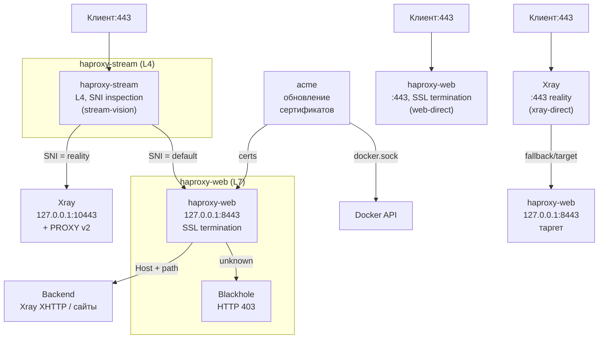

# HAProxy

TLS-прокси для маршрутизации трафика по SNI с автоматическим управлением сертификатами.

## Оглавление

- [Используемые образы](#используемые-образы)
- [Схема работы](#схема-работы)
- [Тестовое окружение](#тестовое-окружение)
- [Порядок настройки](#порядок-настройки)
- [Структура](#структура)
- [Быстрый старт](#быстрый-старт)
- [Главное меню](#главное-меню)
- [Управление Stream](#управление-stream)
- [Управление Web](#управление-web)
- [Фронтенды](#фронтенды)
- [Бэкенды](#бэкенды)
- [Управление сертификатами](#управление-сертификатами)
- [Пресеты](#пресеты)
- [Формат sites.conf v3](#формат-sitesconf-v3)
- [Кастомные вставки](#кастомные-вставки)
- [Бэкапы и откат](#бэкапы-и-откат)
- [Конфигурация](#конфигурация)
- [Общая библиотека common.sh](#общая-библиотека-scriptslibcommonsh)
- [Обновление конфигов](#обновление-конфигов)
- [Переменные окружения](#переменные-окружения)
- [Зависимости](#зависимости)

## Используемые образы

| Компонент | Образ | Источник |
|---|---|---|
| HAProxy Stream | [`haproxy:alpine`](https://hub.docker.com/_/haproxy) | Docker Hub |
| HAProxy Web | [`haproxy:alpine`](https://hub.docker.com/_/haproxy) | Docker Hub |
| ACME | [`neilpang/acme.sh`](https://hub.docker.com/r/neilpang/acme.sh) | Docker Hub |

## Схема работы

Три фронта `:443` на выбор (пресеты `web-direct` / `xray-direct` / `stream-vision`):


```mermaid
flowchart TB
    CLIENT["Клиент:443"] --> STREAM["haproxy-stream<br/>L4, SNI inspection<br/>(stream-vision)"]
    CLIENT2["Клиент:443"] --> WEBD["haproxy-web<br/>:443, SSL termination<br/>(web-direct)"]
    CLIENT3["Клиент:443"] --> XRAY["Xray<br/>:443 reality<br/>(xray-direct)"]

    STREAM -->|SNI = reality| BK1["Xray<br/>127.0.0.1:10443<br/>+ PROXY v2"]
    STREAM -->|SNI = default| WEB["haproxy-web<br/>127.0.0.1:8443<br/>SSL termination"]
    XRAY -->|fallback/target| WEBT["haproxy-web<br/>127.0.0.1:8443<br/>таргет"]

    WEB -->|Host + path| BE1["Backend<br/>Xray XHTTP / сайты"]
    WEB -->|unknown| BLACKHOLE["Blackhole<br/>HTTP 403"]

    ACME["acme<br/>обновление<br/>сертификатов"] -->|certs| WEB
    ACME -->|docker.sock| DOCKER["Docker API"]

    subgraph "haproxy-stream (L4)"
        STREAM
    end

    subgraph "haproxy-web (L7)"
        WEB
        BLACKHOLE
    end
```

## Тестовое окружение

Конфигурации протестированы на **Debian 12** и **Debian 13**.

## Порядок настройки

1. **Скачивание** — получить конфиги из репозитория
2. **Подготовка** — настроить порты (root в контейнере или sysctl)
3. **Запуск** — `./haproxy.sh` интерактивно создаст `sites.conf` (v3)
4. **Stream** — добавить SNI-маршруты через меню (раздел 1)
5. **Web** — добавить Host-маршруты через меню (раздел 2)
6. **Сертификаты** — выпустить и задеплоить

---

## Скачивание

### Через curl

```bash
curl -L https://github.com/thegrayfoxxx/configs/archive/main.tar.gz | tar xz --wildcards --strip=1 '*/haproxy'
cd haproxy
```

### Через git clone

```bash
git clone https://github.com/thegrayfoxxx/configs.git
cd configs/haproxy
```

---

## Структура

```
haproxy/
├── haproxy.sh                    # тонкий диспетчер главного меню (1-6)
├── compose.yml                   # Docker Compose: stream + web + acme (profiles + log-лимиты)
├── sites.conf                    # конфигурация v3 (генерируется скриптами, не в git)
├── sites.conf.example            # шаблон v3 с комментариями ко всем опциям
├── .enabled_services             # включённые профили (не в git)
├── .backup/                      # ротация бэкапов (не в git)
├── custom/                       # твои вставки *.cfg (переживают регенерацию, не в git)
│   ├── stream-frontend-*.cfg     # -> конец frontend ft_https
│   ├── stream-backend-*.cfg      # -> конец stream-бэкендов
│   ├── web-frontend-*.cfg        # -> конец frontend ft_https_terminated
│   └── web-backend-*.cfg         # -> конец web-бэкендов
├── presets/                      # библиотека сценариев (в git, тут живет конкретика xray/reality)
│   ├── web-direct/              # web на :443 напрямую (sites или xhttp-сплит, без стрима)
│   ├── xray-direct/             # Xray на :443, web только как fallback-таргет
│   └── stream-vision/           # stream делит по SNI (SELFSTEAL x WEB_MODE: sites/xhttp)
├── stream/
│   ├── haproxy.cfg               # генерируется из sites.conf
│   └── haproxy.cfg.example       # шаблон
├── web/
│   ├── haproxy.cfg               # генерируется из sites.conf
│   ├── haproxy.cfg.example       # шаблон
│   └── certs/                    # PEM-файлы сертификатов
├── tests/                        # bash-тесты: bash -n, golden, юниты (запуск: bash tests/run.sh)
│   └── fixtures/                 # эталоны и фикстуры
└── scripts/
    ├── ui/                       # presentation-слой: меню, статус, логи, regen, validate
    │   ├── menu.sh               # реестр-helpers: TTY-ввод, подтверждения, диспетчер
    │   ├── status.sh             # статус + рестарт всех
    │   ├── logs.sh               # подменю логов stream/web/acme
    │   ├── regen.sh              # перегенерация с diff-превью
    │   └── validate.sh           # проверка haproxy -c
    ├── commands/                 # доменные команды (по одной ответственности)
    │   ├── stream.sh             # SNI-маршруты + фронтенды + ящики stream (без xray)
    │   ├── web.sh                # Host-маршруты + фронтенды + ящики web + предложение серта
    │   ├── cert.sh               # сертификаты (+ --issue/--deploy/--remove для скриптов)
    │   ├── services.sh           # юниты сервисов + init
    │   ├── backups.sh            # бэкапы и откат
    │   ├── init.sh               # чистый старт (сервисы → конфиг → up)
    │   ├── migrate.sh            # миграция sites.conf v1/v2 → v3
    │   ├── preset.sh             # движок пресетов (list/show/apply/diff/new, when/#if)
    │   ├── global.sh             # глобальные опции (таймауты/бинды/PROXY/blackhole/логи)
    │   └── update.sh             # обновление из репозитория по allowlist (с бэкапом)
    ├── *.sh                      # тонкие шимы в commands/ (cert/services/backups/migrate/preset/update/init/global)
    └── lib/common.sh             # ядро: парсеры v3, генераторы, docker/svc, бэкапы, валидация
```

---

## Быстрый старт

### Шаг 1 — запусти

```bash
cd haproxy
./haproxy.sh
```

При первом запуске:
1. Если `sites.conf` нет — интерактивный опрос (email, stream-маршруты, web-маршруты)
2. Если конфигов HAProxy нет — автоматическая генерация
3. Если `sites.conf` новее конфигов — предложение перегенерировать

Ввод `0` или пустая строка = отмена/назад во всех меню.
Ввод `?` в любом меню = шпаргалка по форматам.
Удаление всегда спрашивает подтверждение с именем; добавление показывает
итог перед записью. Перед каждой записью — автобэкап в `.backup/`.

### Шаг 2 — добавь web-маршрут

```
2 → Ввести домен и бэкенд (порт или host:порт)
```

Скрипт автоматически:
1. Обновит `sites.conf`
2. Сгенерирует `stream/haproxy.cfg` и `web/haproxy.cfg`
3. Предложит выпустить сертификат
4. Предложит перезапустить сервисы

### Шаг 3 — добавь stream-маршрут

```
1 → Ввести SNI через пробел, backend host:порт, PROXY и имя
```

Скрипт автоматически:
1. Обновит `sites.conf`
2. Сгенерирует конфиги
3. Предложит перезапустить сервисы

> Нужен xray/reality-сценарий целиком? Раздел 4 меню → пресет `stream-vision`
> (vision-ветка + web; конкретика живет в пресетах, ядро нейтрально).

---

## Ручная настройка (без скриптов)

### Шаг 1 — создай sites.conf

```bash
cp sites.conf.example sites.conf
```

Отредактируй `sites.conf` (формат v3, см. [Формат sites.conf v3](#формат-sitesconf-v3)):

```bash
ACME_EMAIL="mailname@example.com"

STREAM_ROUTES=(
  "sni=vpn.example.com to=127.0.0.1:10443 proxy=off name=sni-1"
  "sni=default to=127.0.0.1:8443 proxy=off name=web"
)

WEB_ROUTES=(
  "host=site1.com to=127.0.0.1:8080"
)
```

### Шаг 2 — сгенерируй конфиги

```bash
source scripts/lib/common.sh
generate_configs
```

Или скопируй шаблоны и отредактируй вручную:

```bash
cp stream/haproxy.cfg.example stream/haproxy.cfg
cp web/haproxy.cfg.example web/haproxy.cfg
```

### Шаг 3 — запусти

```bash
docker compose up -d
```

### Шаг 4 — выпусти сертификат

```bash
docker compose exec acme acme.sh --issue -d "example.com" --standalone --httpport 80 --email "mailname@example.com"
docker compose exec acme acme.sh --deploy -d "example.com" --deploy-hook haproxy
```

### Шаг 5 — перезапусти

```bash
docker restart haproxy-web
```

---

## Главное меню

```bash
./haproxy.sh
```

В шапке отображается статус:

```
┌─────────────────────────────────────────────┐
│  🔧  HAPROXY MANAGER
└─────────────────────────────────────────────┘

┌─────────────────────────────────────────────┐
│  Сервисы: ● stream  ● web  ● acme
│  Профили: stream web acme
│  Конфиг:  2 stream  1 web
│  Custom:  2 файлов
│  HAProxy:  ок
│  Серты:   3
└─────────────────────────────────────────────┘
```

| Индикатор | Значение |
|-----------|----------|
| `● stream / web / acme` | Зелёный = запущен, красный = остановлен |
| `stream / web` | Количество маршрутов из `sites.conf` |
| `Фронтенды` | Строка появляется, если заданы `*_FRONTENDS`: количество фронтендов |
| `Профили` | Включённые сервисы (`.enabled_services`) для `docker compose --profile` |
| `Custom` | Сколько `custom/*.cfg` подклеится при генерации |
| `HAProxy: ок` | Конфиги синхронизированы |
| `HAProxy: устарели` | `sites.conf` новее конфигов |
| `HAProxy: нет конфигов` | Конфиги не сгенерированы |
| `Серты: N` | Количество PEM-файлов в `web/certs/` |

**Пункты меню:**

| Пункт | Действие |
|-------|----------|
| `1` | Stream: маршруты, фронтенды, бэкенды (SNI → backend) |
| `2` | Web: маршруты, фронтенды, бэкенды (Host → backend) |
| `3` | Сертификаты: выпустить/деплой/проверить/удалить |
| `4` | Пресеты (готовые сценарии: list/show/apply/diff/new) |
| `5` | Сервисы и логи: статус, рестарт всех, логи, вкл/выкл/рестарт по каждому + init |
| `6` | Конфиги и бэкапы: перегенерация с diff, `haproxy -c`, миграция → v3, обновление, откат, глобальные опции |

---

## Управление Stream

```bash
./haproxy.sh → пункт 1
```

| Пункт | Действие |
|-------|----------|
| `1` | Маршруты (добавить/изменить/удалить/список, см. ниже) |
| `2` | Фронтенды (добавить/изменить/удалить/список) |
| `3` | Бэкенды (добавить/изменить/удалить/список) |
| `0` | Назад |

В шапке секции — компактный статус: число маршрутов, фронтендов и бэкендов
(как статус-бокс главного меню, но по одному сервису).

### Маршруты Stream

Таблица маршрутов показана в шапке подменю и обновляется при каждом возврате.

| Пункт | Действие |
|-------|----------|
| `1` | Добавить маршрут |
| `2` | Изменить маршрут (все поля с дефолтами, итог перед записью) |
| `3` | Удалить маршрут (с подтверждением) |
| `0` | Назад |

### Добавление маршрута

Скрипт спросит:
1. **SNI через пробел** — например, `vpn.example.com`
2. **Бэкенд** — номер существующего ящика (раздел «Бэкенды») или `0` = новый адрес
3. Для нового адреса: **host:порт**, **PROXY** (`off`/`v1`/`v2`), **имя**, **логи** (`on`/`off`)
4. **Фронтенд** — имя из раздела «Фронтенды» (Enter = все; спрашивается, только если фронтенды заданы)

Настройки `proxy`/`log` живут на ящике: у ссылки `use=` их спрашивать нечего.

Запись `sni=default` (дефолт в web-терминацию) создается автоматически
и здесь не правится — только показ в списке.

После добавления:
- Обновляется `sites.conf`
- Генерируются `stream/haproxy.cfg` и `web/haproxy.cfg`
- Предлагается перезапустить сервисы

### Изменение маршрута (пункт 2)

Выбор из списка (включая `sni=default` — у него правится только backend),
далее подменю «что меняем»: SNI / Backend / PROXY / Имя / Логи / Фронтенд.
Текущие значения видны сразу, пустые поля у ссылок помечены. `0` — итог
было/стало с подтверждением; без изменений ничего не пишется. Очистить
область — ввести `-` в пункте Фронтенд. Имена фронтендов/ящиков неизменны
(на них ссылаются).

### Формат записи в sites.conf

```bash
STREAM_BACKENDS=(
  "name=vpn to=127.0.0.1:10443"
  "name=metrics to=127.0.0.1:9090 log=off"  # тихий backend (no log)
)
STREAM_ROUTES=(
  "sni=vpn.example.com use=vpn"
  "sni=a.com b.com to=127.0.0.1:10444 proxy=v2 name=sni-2"  # инлайн без ящика
  "sni=default to=127.0.0.1:8443 proxy=off name=web"  # обязателен (см. разрешение ниже)
)
STREAM_FRONTENDS=(
  "name=public bind=*:443"
  "name=internal bind=127.0.0.1:4443 log=off"
)
```

---

## Управление Web

```bash
./haproxy.sh → пункт 2
```

| Пункт | Действие |
|-------|----------|
| `1` | Маршруты (добавить/изменить/удалить/список, см. ниже) |
| `2` | Фронтенды (добавить/изменить/удалить/список) |
| `3` | Бэкенды (добавить/изменить/удалить/список) |
| `0` | Назад |

В шапке секции — компактный статус: число маршрутов, фронтендов и бэкендов.

### Маршруты Web

Таблица маршрутов показана в шапке подменю и обновляется при каждом возврате.

| Пункт | Действие |
|-------|----------|
| `1` | Добавить маршрут |
| `2` | Изменить маршрут (все поля с дефолтами, итог перед записью) |
| `3` | Удалить маршрут (с подтверждением) |
| `0` | Назад |

### Добавление маршрута

Скрипт спросит:
1. **Домен** — например, `example.com`
2. **Бэкенд** — номер существующего ящика (раздел «Бэкенды») или `0` = новый адрес (порт или host:порт)
3. **Path-префикс** — опционально (например, `/data/` — правило выше общего)
4. Для нового адреса: **логи** (`on`/`off`)
5. **Фронтенд** — имя из раздела «Фронтенды» (Enter = все; спрашивается, только если фронтенды заданы)

После добавления:
- Обновляется `sites.conf`
- Генерируются конфиги
- Предлагается выпустить сертификат и перезапустить сервисы

### Изменение маршрута (пункт 2)

Выбор из списка, далее подменю «что меняем»: Домен / Backend / Path /
Логи / Фронтенд. Текущие значения видны сразу; у ссылок `use=` поля
ящика помечены прочерком. `0` — итог было/стало с подтверждением;
без изменений ничего не пишется. Очистить path/область — ввести `-`.
Ящик переключается выбором из списка, адрес — переписывается.

### Формат записи в sites.conf

```bash
WEB_BACKENDS=(
  "name=app to=127.0.0.1:8080 log=off"  # тихий backend (no log)
)
WEB_ROUTES=(
  "host=domain.com use=app"
  "host=api.example.com to=127.0.0.1:9090"  # инлайн без ящика
)
```

---

## Фронтенды

Именованные «уши»: каждый слушает свой `bind`, у каждого свои SNI/Host-правила.
Маршрут с `frontend=<имя>` виден только там; без ключа — везде.
Пустые массивы = одиночный режим как раньше (фронтенд из `bind_stream`/`bind_web`).

```bash
STREAM_FRONTENDS=(
  "name=public bind=*:443"
  "name=internal bind=127.0.0.1:4443 log=off"
)
WEB_FRONTENDS=(
  "name=main bind=127.0.0.1:8443"
)
```

Правила:
- `sni=default` резолвится на фронтенд: свой (с `frontend=<имя>`) важнее
  глобального (без ключа); нет ни одного — генерация падает
- бэкенды общие между фронтендами (печатаются один раз)
- `bind_stream`/`bind_web` при непустых массивах игнорируются; при создании
  первого фронтенда через меню текущий bind авто-импортируется как `name=main`
- удалить фронтенд, на который ссылаются маршруты, нельзя (скрипт их перечислит)
- кастомные вставки `*-frontend-*.cfg` подклеиваются в **каждый** фронтенд
- дефолт тоже правится: пункт «Изменить» при пустых массивах предлагает
  создать явный `main` из текущего bind и сразу его правит (было/стало,
  валидация, save — как обычно)

Управление: разделы Stream/Web → пункт «Фронтенды» (добавить/изменить/удалить/список).
Второе ухо (два stream-фронтенда) делается вручную через `frontend=` + merge:
ядро и генератор это умеют, отдельного пресета нет.

---

## Бэкенды

Именованные «ящики»: адрес и флаги живут в одном месте, маршруты ссылаются
через `use=<имя>` (можно несколько маршрутов в один ящик). Без ящиков
маршруты несут адрес инлайн через `to=` (анонимный ящик, как раньше).

```bash
STREAM_BACKENDS=(
  "name=vpn to=127.0.0.1:10443 proxy=off log=on"
)
WEB_BACKENDS=(
  "name=app to=127.0.0.1:8080 log=off"
)
```

Правила:
- в маршруте ровно один из `to=`/`use=`; при `use=` ключи `name`/`proxy`/`log`
  запрещены (живут на ящике) — генерация падает
- ссылка в несуществующий ящик — генерация падает (трафик в никуда недопустим)
- удалить занятый ящик нельзя (скрипт перечислит ссылающиеся маршруты)
- висячий ящик (без маршрутов) — варнинг, секция печатается, трафика нет
- имена ящиков/маршрутов/дефолтов не должны пересекаться (иначе секции задвоятся)
- `forwardfor_backends` ссылается на `bk_<имя>` — с ящиками имена предсказуемы

Управление: разделы Stream/Web → пункт «Бэкенды» (добавить/изменить/удалить/список
со счетчиком маршрутов); при добавлении маршрута — выбор ящика списком
или новый адрес. Имя ящика неизменно (на него ссылаются маршруты) —
остальное правится на месте с показом было/стало и числом затронутых маршрутов.
Готовые сценарии: пресет `stream-vision` (раздел 4 меню).

---

## Управление сертификатами

```bash
./haproxy.sh → пункт 3
```

| Пункт | Действие |
|-------|----------|
| `1` | Выпустить сертификат |
| `2` | Деплой сертификата |
| `3` | Выпустить + деплой |
| `4` | Список сертификатов |
| `5` | Проверить сертификат |
| `6` | Удалить сертификат |
| `7` | Принудительно обновить |
| `0` | Назад |

### Выпуск сертификата

При выпуске сертификата (пункты 1 и 3) можно:
- **Ввести домен вручную**
- **Выбрать из списка хостов** web-маршрутов (если маршруты уже есть)

Ввод `0` или пустая строка = отмена.

Неинтерактивно (для скриптов, вызывается из `web.sh` автоматически):

```bash
./scripts/commands/cert.sh --issue example.com
./scripts/commands/cert.sh --deploy example.com
./scripts/commands/cert.sh --remove example.com
```

### Деплой в HAProxy

```bash
docker compose exec acme acme.sh --deploy -d "example.com" --deploy-hook haproxy
```

Deploy hook автоматически:
- Объединяет приватный ключ и fullchain в один PEM-файл
- Сохраняет в `/etc/haproxy/certs`
- Перезапускает `haproxy-web` через Docker socket API

### Автоматическое обновление

acme.sh обновляет сертификаты каждые 30 дней. После обновления deploy hook автоматически перезапускает `haproxy-web`.

---

## Конфигурация

### sites.conf (v3)

Единственный источник правды. Конфиги HAProxy генерируются из него автоматически.

```bash
ACME_EMAIL="mailname@example.com"

# Stream-маршруты (L4, SNI -> backend). Запись sni=default обязательна.
STREAM_ROUTES=(
  "sni=vpn.example.com to=127.0.0.1:10443 proxy=off name=sni-1"
  "sni=default to=127.0.0.1:8443 proxy=off name=web"
)

# Web-маршруты (L7, Host -> backend за терминацией)
WEB_ROUTES=(
  "host=site1.com to=127.0.0.1:8080"
  "host=example.com to=127.0.0.1:9090"
)
```

Файлы v1/v2 читаются (автоконверсия в памяти), но `save` всегда пишет v3.
Миграция файла: раздел 6 меню → миграция, подробнее — `MIGRATION.md`.

### Генерация конфигов

Конфиги генерируются автоматически при:
- Добавлении/удалении stream-маршрутов
- Добавлении/удалении web-маршрутов
- Применении пресета
- Первом запуске (интерактивная настройка)
- Ручной перегенерации (раздел 6 в меню, с diff-превью)

Также проверяется синхронизация: если `sites.conf` новее конфигов, скрипт предложит перегенерировать.

### Пример сгенерированного stream/haproxy.cfg

```
global
    log stdout format raw local0
    maxconn 4096

defaults
    log     global
    mode    tcp
    ...

frontend ft_https
    bind *:443
    mode tcp
    tcp-request inspect-delay 5s
    tcp-request content accept if { req.ssl_hello_type 1 }

    acl is_s_1 req.ssl_sni -i vpn.example.com
    use_backend bk_sni-1 if is_s_1

    default_backend bk_web

backend bk_sni-1
    mode tcp
    server sni-1 127.0.0.1:10443

backend bk_web
    mode tcp
    server web 127.0.0.1:8443
```

### Пример сгенерированного web/haproxy.cfg

```
global
    ...
    crt-base /etc/haproxy/certs

frontend ft_https_terminated
    bind *:8443 ssl crt /etc/haproxy/certs/
    mode http

    acl host_site_site_com hdr(host) -i site.com
    use_backend bk_site_site_com if host_site_site_com

    default_backend bk_blackhole

backend bk_site_site_com
    mode http
    server site_site_com 127.0.0.1:8080

backend bk_blackhole
    mode http
    http-request deny
```

### Volumes

| Volume | Описание |
|--------|----------|
| `acme:/acme.sh` | Внутренние данные acme.sh (аккаунт, сертификаты) |
| `./web/certs:/etc/haproxy/certs` | Выпущенные сертификаты (PEM-файлы) |

### Сеть

Все сервисы используют `network_mode: host`.

---

## Общая библиотека `scripts/lib/common.sh`

| Функция | Назначение |
|---|---|
| `clear_screen()` | Очистка экрана с очисткой буфера прокрутки |
| `log_info()` / `log_warn()` / `log_error()` | Цветной вывод сообщений |
| `die()` | Вывод ошибки и выход |
| `print_header(title, icon)` | Шапка меню в рамке |
| `print_status_box()` | Блок статуса (контейнеры, конфиги, серты) |
| `require_cmd(cmd, hint)` | Проверка наличия утилиты |
| `require_docker()` | Проверка Docker daemon и Docker Compose |
| `validate_port(port, name)` | Валидация порта (1-65535) |
| `validate_domain(domain)` | Валидация формата домена |
| `safe_docker_compose(...)` | Безопасный запуск docker compose с обработкой ошибок |
| `haproxy_is_running()` | Проверка запущен ли контейнер `haproxy-stream` |
| `require_haproxy()` | То же, но с `die()` при ошибке |
| `ensure_sites_conf()` | Проверка наличия `sites.conf`, интерактивное создание |
| `ensure_configs()` | Проверка синхронизации конфигов с `sites.conf` |
| `interactive_setup()` | Интерактивный опрос для создания `sites.conf` |
| `load_sites()` / `save_sites()` | Чтение (v1/v2/v3 с автоконверсией) / запись (всегда v3) `sites.conf` |
| `legacy_to_v3_arrays()` | In-memory миграция legacy-массивов в v3 |
| `parse_stream_route()` / `parse_web_route()` | Строгий разбор v3-записей (fail-closed) |
| `parse_frontend()` / `parse_stream_backend()` / `parse_web_backend()` | Разбор именованных фронтендов и ящиков |
| `validate_frontends kind` / `validate_backend_refs kind` | Уникальность имен; ссылки `use=` резолвятся (висячие ящики — варнинг) |
| `resolve_stream_backend()` / `resolve_web_backend()` | Lookup ящика по имени (`to/proxy/log`) |
| `frontend_add/remove/exists/refs` / `backend_add/remove/exists/refs` | CRUD сущностей для команд (ссылки/дубли проверяются) |
| `acl_name_for()` | Уникальные имена ACL (`_2` при коллизии — haproxy затирает дубли) |
| `maybe_forwardfor()` | `option forwardfor` точечно по `forwardfor_backends` |
| `convert_legacy_to_v3()` | Печать v3-эквивалента legacy-массивов (для migrate) |
| `ensure_stream_default()` | Дописать `sni=default`, если его нет |
| `generate_configs()` | Генерация `stream/haproxy.cfg` и `web/haproxy.cfg` |
| `generate_stream_config()` | Генерация L4-конфига (легаси v1/v2; v3-ветка если заданы `STREAM_ROUTES`) |
| `generate_web_config()` | Генерация L7-конфига (легаси v1/v2; v3-ветка если заданы `WEB_ROUTES`) |

Слои: `scripts/ui/` — presentation (меню/статус/логи), `scripts/commands/` —
доменные команды, `scripts/lib/common.sh` — ядро без UI-зависимостей.

---

## Обновление конфигов

Через главное меню:

```bash
./haproxy.sh → раздел 6 → обновление
```

Скачивает свежие файлы из репозитория по allowlist (код/шаблоны/доки)
и обновляет скрипты. Локальное состояние (`sites.conf`, `.enabled_services`,
`.backup/`, живые конфиги, `web/certs/`, `custom/*.cfg`) никогда не затирается.

Напрямую:

```bash
./scripts/commands/update.sh
```

---

## Переменные окружения

### Интерфейс

| Переменная | Описание |
|---|---|
| `NO_COLOR` | Непустая = выключить цвета (стандарт no-color.org) |
| `HAPROXY_NO_CLEAR` | Непустая = не чистить экран (сохраняет скроллбэк, удобно по SSH) |

### compose.yml

| Переменная | Описание |
|---|---|
| `DEPLOY_HAPROXY_PEM_PATH` | Путь для PEM-файлов (по умолчанию `/etc/haproxy/certs`) |
| `DEPLOY_HAPROXY_RELOAD` | Команда перезапуска haproxy-web через Docker socket API |

### sites.conf

| Переменная | Описание | Пример |
|---|---|---|
| `ACME_EMAIL` | Email для сертификатов | `mail@example.com` |
| `STREAM_ROUTES` | SNI-маршруты (`sni/to|use/proxy/name/log/frontend`, один `sni=default` обязателен) | `"sni=vpn.example.com use=vpn"` |
| `WEB_ROUTES` | Host-маршруты (`host/to|use/path/name/log/frontend`) | `"host=site.com use=app"` |
| `STREAM_BACKENDS` | Именованные L4-ящики (`name/to/proxy/log`) | `"name=vpn to=127.0.0.1:10443"` |
| `WEB_BACKENDS` | Именованные L7-ящики (`name/to/log`) | `"name=app to=127.0.0.1:8080"` |
| `STREAM_FRONTENDS` / `WEB_FRONTENDS` | Именованные уши (`name/bind/log`), пусто = одиночный режим | `"name=public bind=*:443"` |

---

## Зависимости

- **bash** 4+
- **docker** с Docker Compose
- **curl** (для обновлений из репозитория)
- **openssl** (для проверки сертификатов)

---

## Пресеты

Готовые сценарии в `presets/<имя>/`: `preset.conf` (шаблон `sites.conf` с `{{VAR}}`
и условными блоками `#if COND ... #else ... #endif`),
`questions` (вопросы визарда `VAR|промпт|дефолт|валидатор[|when:COND]`), `README.md`, `custom/` (оверлей).

> Управляем только HAProxy. Xray/nginx/static/CDN — отдельно, в пресетах только
> стык (порты/домены/path/SNI). Примеры чужих конфигов в README пресетов — для сверки.

Валидаторы визарда: `any`, `nonempty`, `domain`, `port`, `email`, `bind`
(`host:порт`), `snis` (домены через пробел), `hostport` (порт или `host:порт`),
`path` (с `/`), `oneof:a,b` (строго из списка), `list:domainport`, `list:hostport`.
COND: `VAR==val[&&VAR2!=val2]`, значения через запятую = ИЛИ. Вопрос с `when:`
задается только если условие выполнено; блок `#if` попадает в рендер только
если условие выполнено (плейсхолдеры из выключенных веток ответов не требуют).
Мусор отклоняется сразу в визарде (и в `--answers`), а не на генерации.

```bash
./haproxy.sh → раздел 4   # выбор пресета номером из списка
# или напрямую:
./scripts/commands/preset.sh list                  # список
./scripts/commands/preset.sh show                  # выбор номером + README + вопросы
./scripts/commands/preset.sh show stream-vision    # README + вопросы сразу
./scripts/commands/preset.sh apply                 # выбор номером → визард → diff → потери → запись → generate
./scripts/commands/preset.sh apply web-direct --dry-run --answers ans.txt  # только конфиг на stdout
./scripts/commands/preset.sh apply web-direct --merge --yes --answers ans.txt  # слить с текущим без вопросов
./scripts/commands/preset.sh diff xray-direct              # дефолты vs текущий sites.conf
./scripts/commands/preset.sh new my-preset                 # скелет своего пресета (v3)
```

Применение поверх существующего конфига: скрипт показывает diff, затем —
что именно исчезнет (фронтенды/ящики/маршруты/email/опции). Дальше на выбор:
**[з]атереть** (как раньше, с бэкапом `pre-preset-*`), **[с]лить** (общее
скипается, конфликт имен/содержимого — ошибка, файл цел) или **отмена**.
`--yes` при потерях без `--merge` — отказ (нужно явное решение).
При слиянии email и глобальные опции остаются текущие (варнинг).

`--dry-run` печатает только готовый конфиг (без шапки) — вывод можно
перенаправлять в файл. Неинтерактивный ввод визарда — через файл:
`PRESET_TTY=ответы.txt` (по строке на вопрос, пустая строка = дефолт/готово).

Встроенные (фронт `:443` → режим):
`web-direct` (web напрямую: `WEB_MODE=sites` — N сайтов, `xhttp-split` — path-сплит без стрима),
`xray-direct` (Xray напрямую, web только fallback-таргет),
`stream-vision` (stream делит по SNI; матрица `SELFSTEAL=no/yes × WEB_MODE=sites/xhttp-split`).
Детали, требования к xray/CDN и проверки — в `presets/<имя>/README.md`.

Какой брать: нет reality — `web-direct` (или `xray-direct` если `:443` уже у Xray);
есть vision — `stream-vision`. Стрим без reality не нужен (SNI делить нечего).

---

## Формат sites.conf v3

Ядро нейтрально: stream = SNI-маршруты, web = Host-маршруты. Никаких
`reality/xray` в скриптах и формате — конкретика живет только в пресетах.
Файлы v1/v2 читаются (автоконверсия в памяти, семантика сохраняется —
проверено e2e-тестом миграции), запись всегда v3.

```bash
STREAM_BACKENDS=(
  "name=vpn to=127.0.0.1:10443"
  "name=metrics to=127.0.0.1:9090 log=off"  # тихий backend (no log)
)
WEB_BACKENDS=(
  "name=app to=127.0.0.1:8080"
)
STREAM_ROUTES=(
  "sni=vpn.example.com use=vpn"              # ссылка на ящик
  "sni=a.com b.com to=127.0.0.1:10444 proxy=v2 name=sni-2"  # инлайн без ящика
  "sni=default to=127.0.0.1:8443 proxy=off name=web"  # обязателен (см. разрешение)
)
WEB_ROUTES=(
  "host=site.com use=app"
  "host=x.com to=127.0.0.1:11443 path=/data/"  # path-правило (выше общего!)
  "host=x.com to=127.0.0.1:8080"               # общее правило того же домена
)
GLOBAL_OPTS=(
  "timeout_client=1h" "timeout_server=1h" "timeout_tunnel=1h"
  "bind_stream=*:443" "bind_web=127.0.0.1:8443"
  "blackhole=deny"                     # deny|tarpit
  "blackhole_deny_status=404"          # код для deny (дефолт 403)
  "stream_web_proxy=v2" "web_accept_proxy=on"  # PROXY-пара (парность проверяется!)
  "backend_check=tcp"                  # healthcheck-и (шумят в логах, opt-in)
  "forwardfor_backends=bk_site_x_com_11443"    # option forwardfor точечно
  "stream_log_sni=on"                  # SNI в stream-лог
  "web_capture_headers=on"             # capture Host и X-Forwarded-For
)
```

Валидация строгая (fail-closed): нет резолвящегося `sni=default` на фронтенд,
битый `proxy`/`log`, неизвестный ключ/`frontend=`/`use=`, маршрут без адреса
(`to=` xor `use=`), `name`/`proxy`/`log` при `use=`, ссылка в несуществующий
ящик, дубли имен внутри вида (ящики/инлайн/default между собой; stream и web —
разные неймспейсы) — генерация падает,
живые файлы не тронуты. Разрешение default: свой (с областью фронтенда)
важнее глобального. Висячий ящик (без маршрутов) — варнинг, не ошибка.
Нюанс инлайн-web: один backend на пару (домен, порт), поэтому `no log`
ставится, только если **все** его записи с `log=off` (у именованных ящиков
флаг один — правило не нужно).

Все ключи с комментариями — в `sites.conf.example`. Миграция v1/v2→v3:
раздел 6 меню (`migrate.sh`, есть `--dry-run`). Глобальные опции
(таймауты/бинды/PROXY/blackhole/логи) правятся там же: раздел 6 →
«Глобальные опции» (`global.sh`, есть `--show` / `--set K=V`).
Подробнее — `MIGRATION.md`.

---

## Кастомные вставки

Файлы `custom/<секция>-<имя>.cfg` подклеиваются генератором и **никогда**
не затираются (в git не трекаются):

| Маска | Куда подклеивается |
|---|---|
| `stream-frontend-*.cfg` | конец каждого `frontend ft_*` (stream; в multi — в каждый) |
| `stream-backend-*.cfg` | конец stream-бэкендов |
| `web-frontend-*.cfg` | конец каждого `frontend ft_*` (web; в multi — в каждый) |
| `web-backend-*.cfg` | конец web-бэкендов |

Правило: всё, что умеет `sites.conf`/пресеты — туда; `custom/` — только то,
чему нет опции (экзотика, временные хаки). Статус-бокс показывает счётчик файлов.

---

## Бэкапы и откат

Перед каждым `save`/`generate`/миграцией/обновлением — снимок `sites.conf`
и обоих `haproxy.cfg` в `.backup/<дата>-<причина>/` (ротация: последние 10).
Откат: раздел 6 меню (список → выбор → `pre-rollback`-бэкап текущего),
после отката — перезапустить сервисы (раздел 5). Генерация идёт через temp-файлы
с `haproxy -c` и атомарным перемещением: битый конфиг в прод не попадает.

---

## Тесты

```bash
bash tests/run.sh   # bash -n по всем скриптам, golden-тесты генерации, юниты
```

Golden: фикстуры `tests/fixtures/sites*.conf` → эталоны `expected*.cfg`
(v1 — байт-в-байт со старым генератором, v2 — multi-backend/path/PROXY,
v3 — нейтральные маршруты + явный default + fail-closed,
v4 — SNI-лог/capture/forwardfor,
v4fe — именованные фронтенды + области,
v5be — именованные ящики + ссылки use=,
v6 — топологии пресетов `web-direct`/`xray-direct`/`stream-vision`).
`shellcheck` подхватывается автоматически, если установлен.

Валидация строгая (fail-closed): без бинарника `haproxy` генерация падает
(битый конфиг не пишется молча). Обход только явный — `HAPROXY_NO_VALIDATE=1`
(`tests/run.sh` его выставляет, в проде так не делать).
