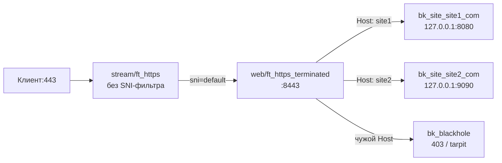

# multi-site-l7 — пачка сайтов без reality

Самый простой сценарий: N обычных сайтов за TLS-терминацией haproxy-web.
В `STREAM_ROUTES` — только явный `sni=default → web`: SNI-фильтра нет,
вся `:443` идёт в web. Неизвестные Host — в blackhole.

## Схема

## Что получишь

* `WEB_ROUTES`: по записи на сайт (`host=домен to=127.0.0.1:порт`).
* `STREAM_ROUTES`: только явный `sni=default → web` — вся `:443` идёт в web.
* `GLOBAL_OPTS`: дефолтные таймауты/stream-bind; `blackhole` на выбор:
  `deny` (быстрый 403) или `tarpit` (держать сканера 10s).

## Требования

1. Сертификаты на все домены — выпускаются пунктом 3 меню (cert.sh)
   после применения (acme standalone на `:80` — порт должен быть свободен,
   скрипт проверит и скажет).
2. Бэкенды слушают loopback-порты из конфига до поднятия (иначе healthcheck
   уронит их из ротации, если включишь `backend_check` позже вручную).

## Проверки после применения

* Каждый домен браузером → свой бэкенд 200.
* Чужой Host → blackhole (`403` при deny; вис на 10s при tarpit).
* `haproxy -c` зелёный.
