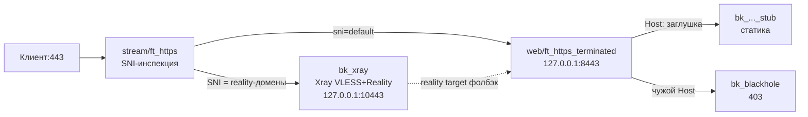

# reality-selfsteal — SNI в xray, остальное в заглушку

Базовый сценарий self-host: `:443` делит stream по SNI. Домены reality едут
в Xray (`VLESS + raw + REALITY + Vision`), весь остальной HTTPS — в web,
где по Host отдаётся сайт-заглушка, неизвестное — в blackhole.

## Схема

## Что получишь

* `STREAM_BACKENDS`: именованный ящик `xray` (`name=xray to=127.0.0.1:порт`).
* `STREAM_ROUTES`: твои домены -> ящик (`sni=... use=xray`) + явный `sni=default → web`.
* `WEB_ROUTES`: домен заглушки -> статика (`host=... to=...`).
* `GLOBAL_OPTS`: таймауты `1h` (длинные proxy-сессии не рвутся на 50s),
  web забинден на loopback, blackhole `deny`, PROXY-пара stream→web
  включена (`stream_web_proxy=v2` + `web_accept_proxy=on` — они парные,
  генератор проверяет).

## Требования со стороны Xray (важно!)

1. Xray inbound слушает `127.0.0.1:<XRAY_PORT>` (не наружу!).
2. `realitySettings.target` смотрит в web-бэкенд (фолбэк-страница).
3. PROXY на ноге stream→xray НЕ включён этим пресетом. Если нужен
   (реальные IP в логе Xray) — допиши `proxy=v2` ящику `xray`
   (`STREAM_BACKENDS`: `name=xray to=... proxy=v2`)
   и включи в Xray `tcpSettings.acceptProxyProtocol`. Оба флага сразу,
    иначе рассинхрон (stream шлёт, Xray не читает — всё ляжет).

## Проверки после применения

* Клиент с ключом ходит; в access-логе Xray внешний IP (если PROXY-пара сошлась).
* Браузер без ключа на домен заглушки → сайт 200.
* Чужой SNI → blackhole 403.
* `haproxy -c` зелёный (раздел 6 меню → проверка); рантайм — `docker logs -f haproxy-web`.
