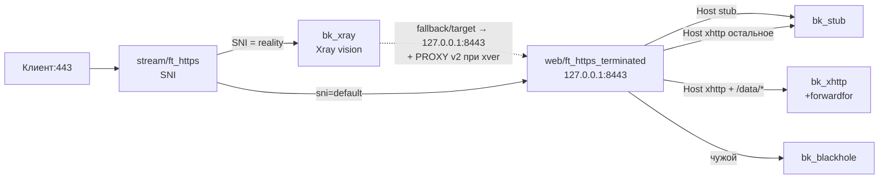

# stream-vision — stream делит по SNI: reality в Xray, остальное в web

> Управляем только HAProxy. Xray/nginx/CDN — отдельно, тут только стык (SNI/Host/порты/path).

Базовый пресет на все стримовые случаи (матрица `SELFSTEAL × WEB_MODE`).
`:443` держит `haproxy-stream`: SNI reality-доменов едет в Xray
(`VLESS + reality + vision`), весь остальной HTTPS — в `haproxy-web`
(`127.0.0.1:8443` + PROXY), где уже делится по Host/path.

## Матрица режимов

| SELFSTEAL | WEB_MODE | Что получится |
|---|---|---|
| `no` | `sites` | reality-SNI отдельно, web — N сайтов (`SITES_LINES`) |
| `yes` | `sites` | то же, но REALITY укажи равным одному из сайтов (селфстил-таргет) |
| `no` | `xhttp-split` | vision-SNI отдельно, web — один XHTTP-домен: `/data/*` → Xray, остальное → stub того же Host |
| `yes` | `xhttp-split` | прод-схема: REALITY SNI = `STUB_DOMAIN`, web — `STUB→stub`, `XHTTP+path→xhttp`, `XHTTP→stub` (fallback в чужой stub) |

## Схема (пример selfsteal+xhttp = прод)

## Что получишь

- `STREAM_BACKENDS/STREAM_ROUTES`: ящик `xray` + ссылка `use=xray`, дефолт в web с `proxy={{STREAM_WEB_PROXY}}`.
- `WEB_BACKENDS/WEB_ROUTES`: либо инлайн-список сайтов, либо ящики `xhttp/stub` + 2-3 записи (path-правило выше общего — гарантирует генератор).
- `GLOBAL_OPTS`: таймауты по `TIMEOUT_PROFILE`, PROXY-пара `stream_web_proxy/web_accept_proxy` (генератор проверяет парность!), `forwardfor` только для xhttp.

## Требования со стороны Xray/CDN (важно!)

Два PROXY-хопа — оба должны сойтись парно, иначе молча ляжет половина схемы:

| # | Нога | Шлет | Должен читать | Опции |
|---|---|---|---|---|
| 1 | `stream → xray:<XRAY_PORT>` | `send-proxy-v2` если `XRAY_PROXY=v2` (дефолт) | `inbounds[].streamSettings.tcpSettings.acceptProxyProtocol: true` в Xray | При `XRAY_PROXY=off` ничего включать не надо, но в логе Xray будет loopback |
| 2 | `xray → web:8443` (reality-fallback) | `PROXY-v2` если `inbounds[].streamSettings.realitySettings.xver: 2` | `bind ... accept-proxy` = `WEB_ACCEPT_PROXY=on` (дефолт — **не выключать** при `xver: 2`) | Если в Xray `xver` нет/0 — можно `off`, но тогда и там и там |

> ❌ Частая ошибка: выключить `WEB_ACCEPT_PROXY` при `xver: 2` в Xray —
> весь fallback (браузеры без ключа) умрет. Генератор проверяет парность
> только пары stream→web, связку xver→web видит только эта таблица — сверяй руками.

Контракт «Xray ⟺ HAProxy» (проверено на проде; пути Xray — от корня JSON конфига):

| Xray (полный путь) | `sites.conf` (вопрос пресета) | Что сгенерируется |
|---|---|---|
| `inbounds[].streamSettings.tcpSettings.acceptProxyProtocol: true` (reality, `:10443`) | `STREAM_BACKENDS`: `name=xray ... proxy=v2` (`XRAY_PROXY=v2`) | `stream/haproxy.cfg`: `server xray 127.0.0.1:10443 send-proxy-v2` |
| `inbounds[].streamSettings.realitySettings.xver: 2` (reality-fallback в `target`) | `GLOBAL_OPTS`: `web_accept_proxy=on` (`WEB_ACCEPT_PROXY=on`) + зеркало `xray_xver=v2` (`XRAY_XVER`, генератор варнит при рассинхроне) | `web/haproxy.cfg`: `bind 127.0.0.1:8443 ssl ... accept-proxy` |
| `inbounds[].streamSettings.realitySettings.target: "127.0.0.1:8443"` + `serverNames: ["<stub>"]` | `SELFSTEAL=yes`, `STUB_DOMAIN` = `REALITY_DOMAINS` | `STREAM_ROUTES`: `sni=<stub> use=xray`; `WEB_ROUTES`: `host=<stub> use=stub` |
| `inbounds[].streamSettings.sockopt.trustedXForwardedFor: ["X-Forwarded-For"]` (xhttp, `:11443`) | само (`GLOBAL_OPTS` → `forwardfor_backends=bk_xhttp` при `WEB_MODE=xhttp-split`) | `web/haproxy.cfg`: `option forwardfor` в `backend bk_xhttp` |
| `inbounds[].streamSettings.xhttpSettings.path: "/data/"` | `WEB_ROUTES`: `... use=xhttp path=...` (`XHTTP_PATH`, строго равно) | `web/haproxy.cfg`: `acl path_xhttp_* path_beg /data/` + `use_backend bk_xhttp` |
| `inbounds[].port` / `inbounds[].listen` | `XRAY_PORT` / `XHTTP_PORT` + `STUB_PORT` | `server xray 127.0.0.1:<XRAY_PORT>`, `server xhttp 127.0.0.1:<XHTTP_PORT>` |

Остальное:

1. Selfsteal: `realitySettings.target` → web-заглушка (`127.0.0.1:<STUB_PORT>` или через web-терминацию).
2. XHTTP-инбаунд: `security:none`, слушает loopback `127.0.0.1:<XHTTP_PORT>`.
3. CDN: origin-pull на `:443` (SNI = XHTTP-домен), `X-Forwarded-For` на origin, `/data/*` — Bypass Cache.
4. Порт `:80` свободен для ACME.
5. Затяни `inbounds[].listen` Xray-инбаундов за haproxy на `"127.0.0.1"` (часто стоит
   `"0.0.0.0"` — порты `inbounds[].port` (`10443`/`11443`) торчат наружу без нужды,
   CDN и клиенты туда ходить не должны).

## Проверки после применения

- Vision-клиент ходит; браузер без ключа → заглушка 200; чужой SNI/Host → blackhole.
- XHTTP: `POST /data/...` без UUID → ответ Xray, `GET /` → stub.
- `haproxy -c` зелёный; без `not a PROXY header` во флуде (рассинхрон пары).
