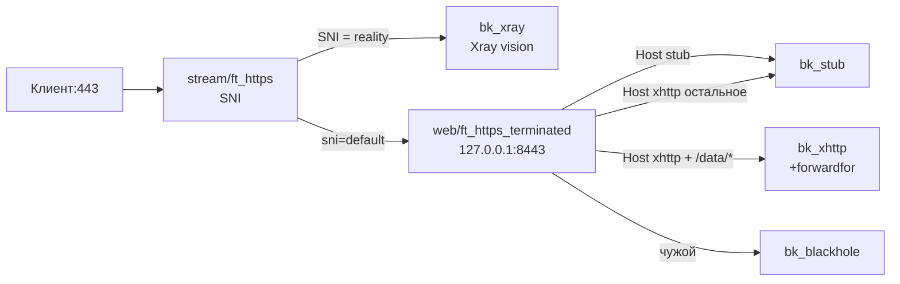

# stream-vision — stream делит по SNI: reality в Xray, остальное в web

> Управляем только HAProxy. Xray/nginx/CDN — отдельно, тут только стык (SNI/Host/порты/path).

Базовый пресет на все стримовые случаи (матрица `SELFSTEAL × WEB_MODE`).
`:443` держит `haproxy-stream`: SNI reality-доменов едет в Xray
(`VLESS + reality + vision`), весь остальной HTTPS — в `haproxy-web`
(`127.0.0.1:8443` + PROXY), где уже делится по Host/path.

## Матрица режимов

| SELFSTEAL | WEB_MODE | Что получится |
|---|---|---|
| `no` | `sites` | reality-SNI отдельно, web — N сайтов (`SITES_LINES`) |
| `yes` | `sites` | то же, но REALITY укажи равным одному из сайтов (селфстил-таргет) |
| `no` | `xhttp-split` | vision-SNI отдельно, web — один XHTTP-домен: `/data/*` → Xray, остальное → stub того же Host |
| `yes` | `xhttp-split` | прод-схема: REALITY SNI = `STUB_DOMAIN`, web — `STUB→stub`, `XHTTP+path→xhttp`, `XHTTP→stub` (fallback в чужой stub) |

## Схема (пример selfsteal+xhttp = прод)

## Что получишь

- `STREAM_BACKENDS/STREAM_ROUTES`: ящик `xray` + ссылка `use=xray`, дефолт в web с `proxy={{STREAM_WEB_PROXY}}`.
- `WEB_BACKENDS/WEB_ROUTES`: либо инлайн-список сайтов, либо ящики `xhttp/stub` + 2-3 записи (path-правило выше общего — гарантирует генератор).
- `GLOBAL_OPTS`: таймауты по `TIMEOUT_PROFILE`, PROXY-пара `stream_web_proxy/web_accept_proxy` (генератор проверяет парность!), `forwardfor` только для xhttp.

## Требования со стороны Xray/CDN (важно!)

1. Xray reality-inbound: `127.0.0.1:<XRAY_PORT>`. Если `XRAY_PROXY=v2` (дефолт) — включи
   `tcpSettings.acceptProxyProtocol`, иначе рассинхрон и ляжет весь reality.
   При `off` — ничего включать не надо, но в логе Xray будет loopback.
2. Selfsteal: `realitySettings.target` → web-заглушка (`127.0.0.1:<STUB_PORT>` или через web-терминацию).
3. XHTTP-инбаунд: `security:none`, `127.0.0.1:<XHTTP_PORT>`, `trustedXForwardedFor` если нужны реальные IP.
4. CDN: origin-pull на `:443` (SNI = XHTTP-домен), `X-Forwarded-For` на origin, `/data/*` — Bypass Cache.
5. Порт `:80` свободен для ACME.

## Проверки после применения

- Vision-клиент ходит; браузер без ключа → заглушка 200; чужой SNI/Host → blackhole.
- XHTTP: `POST /data/...` без UUID → ответ Xray, `GET /` → stub.
- `haproxy -c` зелёный; без `not a PROXY header` во флуде (рассинхрон пары).
