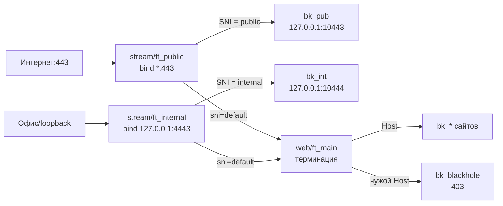

# twin-frontends — два stream-уха + один web

Сценарий для разделения трафика: публичное ухо (`public`, интернет)
и внутреннее (`internal`, офис/loopback) слушают разные адреса, у каждого
свои SNI-маршруты. Маршрут без `frontend=` слышен в оба уха; глобальный
`sni=default` страхует оба фронтенда.

## Схема

## Что получишь

* `STREAM_FRONTENDS`: `public` + `internal` с разными bind.
* `WEB_FRONTENDS`: один `main`.
* `STREAM_ROUTES`: публичный и внутренний маршруты со своей областью
  + глобальный `sni=default → web` (резолвится на оба фронтенда).
* `WEB_ROUTES`: сайты из визарда (видны везде — области нет).

## Проверки после применения

* SNI публичного маршрута на внутреннем адресе — нет совпадения,
  падает в дефолт (а не в чужой backend).
* `haproxy -c` зелёный (раздел 6 меню).
