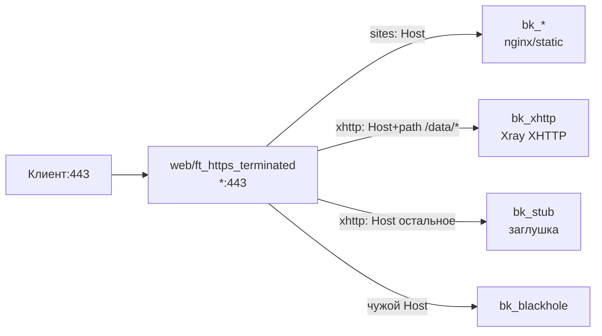

# web-direct — haproxy-web на :443 напрямую, без стрима

> Управляем только HAProxy. Xray/nginx/static — отдельно, тут только стык (порты/домены/path).

Сценарий для обычных сайтов и для `VLESS + XHTTP` без vision-ветки:
`haproxy-web` слушает `:443` и сам терминирует TLS. Stream-сервис не нужен
(SNI делить нечего) — отключи его (только `web` + `acme`).

## Режимы (`WEB_MODE`)

- `sites` — N сайтов (`SITES_LINES`): `Host → backend`.
- `xhttp-split` — один домен: `path /data/*` → Xray XHTTP (`+forwardfor`),
  остальное с того же Host → заглушка.

## Схема

## Что получишь

- `WEB_ROUTES`: либо список сайтов, либо 2 записи path-сплита (path-правило выше общего — гарантирует генератор).
- `GLOBAL_OPTS`: `bind_web=*:443`, таймауты по `TIMEOUT_PROFILE` (`sites-50s` / `xhttp-1h+tunnel`), `blackhole` на выбор.
- Без PROXY-пары (`stream` нет — `accept-proxy` выключен).

## Требования со стороны бэкендов (важно!)

1. **Привилегированный порт**: `:443` требует `user:root` для `haproxy-web` или `sysctl net.ipv4.ip_unprivileged_port_start=443`. Проверь `compose.yml`.
2. **Порт `:80` свободен** на момент выпуска/продления (ACME `standalone --httpport 80`).
3. **XHTTP-режим** (`WEB_MODE=xhttp-split`), контракт с Xray-инбаундом (пути от корня JSON):
   `inbounds[].streamSettings.sockopt.trustedXForwardedFor: ["X-Forwarded-For"]` ⟺ `option forwardfor`
   на `bk_xhttp` (ставится сам); `inbounds[].streamSettings.xhttpSettings.path` ⟺ `XHTTP_PATH`
   (строго равно); инбаунд `security:none`, `inbounds[].listen: "127.0.0.1"`, `inbounds[].port: <XHTTP_PORT>`.
   CDN: origin-pull на `:443`, `X-Forwarded-For` на origin, путь `/data/*` — Bypass Cache.
4. Апгрейд «завтра нужен vision/reality» = переезд на `stream-vision` (смена bind + `svc_enable stream`) с даунтаймом — заложись заранее.

## Проверки после применения

- `haproxy -c` зелёный; `docker logs haproxy-web` чистые.
- Браузер на домен → сайт/заглушка 200; чужой Host → 403 (или tarpit).
- XHTTP: `POST /data/...` без UUID → ответ Xray, а не HTML.
