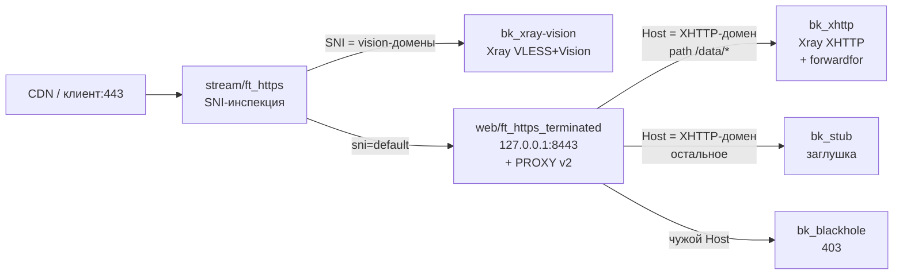

# xhttp-path-split — один домен на два бэкенда по пути

Сценарий для `VLESS + XHTTP` (обычно за CDN): запросы в API-путь
(`/data/*`, чанки packet-up) едут в Xray, всё остальное с того же Host —
в сайт-заглушку. Плюс отдельная reality-ветка для Vision-клиентов.

## Схема

## Что получишь

* `WEB_BACKENDS` / `STREAM_BACKENDS`: ящики поименно (`xhttp`, `stub`,
  `xray-vision`) — маршруты ссылаются через `use=`.
* `WEB_ROUTES`: две записи на один домен — path-правило строго выше
  общего (генератор гарантирует порядок).
* `forwardfor_backends`: `option forwardfor` точечно на ящике `bk_xhttp`
  (имя задано в шаблоне — руками ничего не считать).
* `GLOBAL_OPTS`: таймауты `1h` + `tunnel`, loopback-bind web, PROXY-пара
  stream→web, blackhole `deny`.

## Требования со стороны CDN и Xray (важно!)

1. **CDN origin-pull** ходит на `:443` (SNI = XHTTP-домен) — origin-порт
   отдельно не нужен, stream разрулит по SNI в web.
2. **CDN должен класть `X-Forwarded-For`** на origin-запросах. Иначе
   Xray увидит только `127.0.0.1`: заголовку неоткуда взяться.
   Проверяется дампом loopback-трафика до Xray (`tcpdump -i lo -A port <XHTTP_PORT>`).
3. **Кэш CDN**: путь `/data/*` — Bypass Cache (чанки кэшировать нельзя).
   Для Cloudflare: правило кэша на путь; `Cache-Control: no-store` от Xray
   помогает, но правило надёжнее.
4. **Xray XHTTP-инбаунд**: `security: none` (TLS уже снят CDN и web),
   слушает `127.0.0.1:<XHTTP_PORT>`, `trustedXForwardedFor` — если нужны
   реальные IP в логе Xray (иначе там будет loopback — штатно).
5. Если CDN нет (прямые клиенты в SNI XHTTP-домена): цепочка та же,
   только XFF класть некому — в логе Xray будет loopback. Лечится только
   CDN-заголовком, не конфигом haproxy.

## Проверки после применения

* XHTTP-клиент через CDN едет; в дампе до Xray виден `X-Forwarded-For`
  с внешним IP (если CDN настроен по п.2).
* Браузер без UUID на `/` → заглушка 200; `POST /data/...` без UUID →
  ответ Xray (400/обрыв), а не HTML.
* Vision-клиенты reality-ветки — без изменений.
* `haproxy -c` зелёный; `docker logs -f haproxy-web` без PROXY-флуда
  (если флуд `not a PROXY header` — рассинхрон пары, чинить немедленно).
