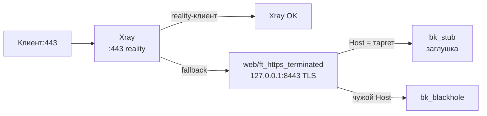

# xray-direct — Xray на :443, haproxy-web только как таргет

> Управляем только HAProxy. Xray/nginx/static — отдельно, тут только стык (порты/домены).

Xray (`VLESS + reality + vision`) слушает `:443` напрямую. Не-reality трафик
Xray заворачивает в fallback-таргет — наш `haproxy-web` на `127.0.0.1:8443`
с настоящим LE-сертификатом, а тот уже отдает заглушку. Stream-сервис выключен.

## Схема

## Что получишь

- `WEB_ROUTES`: одна запись `host=STUB_DOMAIN → stub`.
- `GLOBAL_OPTS`: `bind_web=127.0.0.1:8443` (только loopback — наружу его не видно),
  таймауты по профилю, `web_accept_proxy` по вопросу (см. ниже).

## Требования со стороны Xray (важно!)

1. Inbound: `inbounds[].listen: "*"` (`:443`), `inbounds[].streamSettings.realitySettings.serverNames=[STUB_DOMAIN]`,
   `inbounds[].streamSettings.realitySettings.target=127.0.0.1:8443`
   (raw TCP fallback, SNI сохраняется — web отдаст правильный серт).
2. PROXY на ноге fallback: визард спрашивает `WEB_ACCEPT_PROXY` и `XRAY_XVER`.
   Правило: оба значения = `inbounds[].streamSettings.realitySettings.xver` твоего инбаунда —
   `xver: 2` → отвечай `on` / `v2`, нет `xver` (0) → `off` / `off`.
   `XRAY_XVER` — зеркало для проверки парности (генератор варнит при рассинхроне).
   > ❌ Рассинхрон (Xray шлет `xver`, а web без `accept-proxy` — или наоборот)
   > роняет весь fallback: браузеры без ключа перестанут открываться.
   > В логах web при этом флуд `not a PROXY header`.
3. LE-сертификат для `STUB_DOMAIN` выпускается как обычно через `:80`
   (`:443` занят Xray — выпуску не мешает, нужен только `:80`).
4. Заглушка за web — обычный nginx/static на `127.0.0.1:STUB_PORT`.

## Проверки после применения

- Браузер без ключа → заглушка 200 (через Xray-fallback → web).
- Клиент с ключом ходит.
- `haproxy -c` зелёный; stream-контейнер остановлен/выключен.
